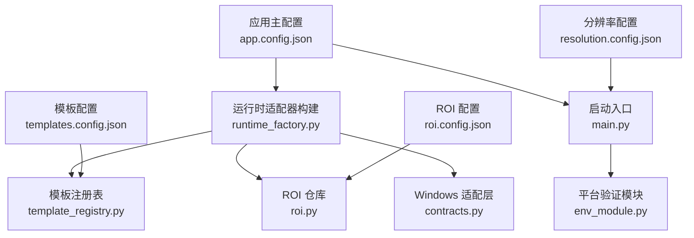
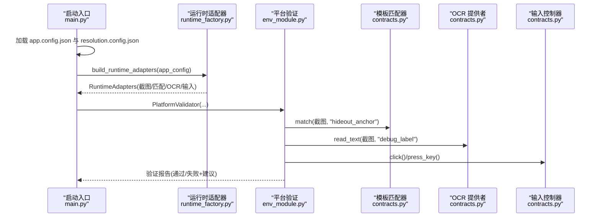
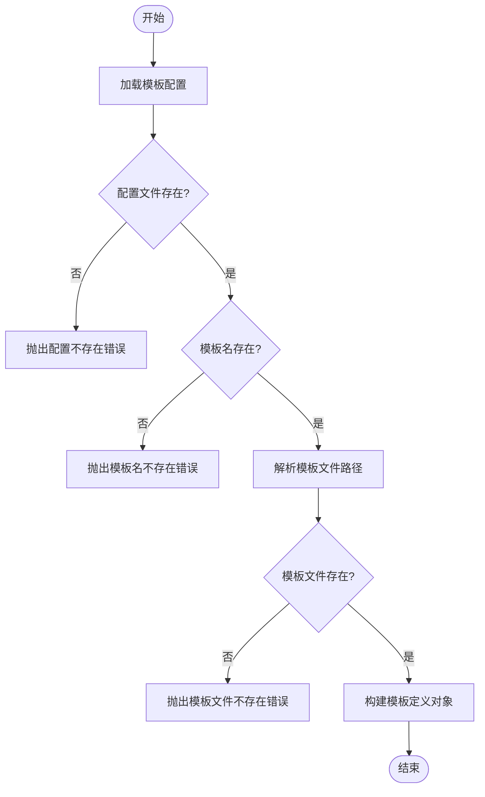
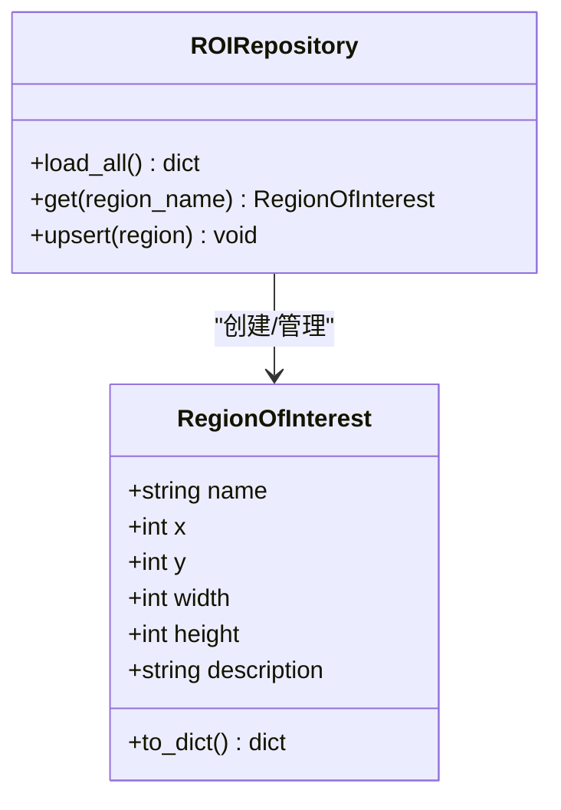
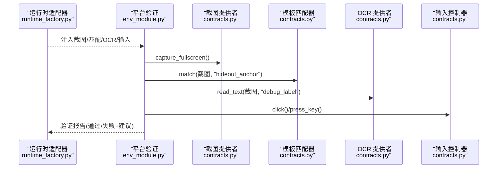
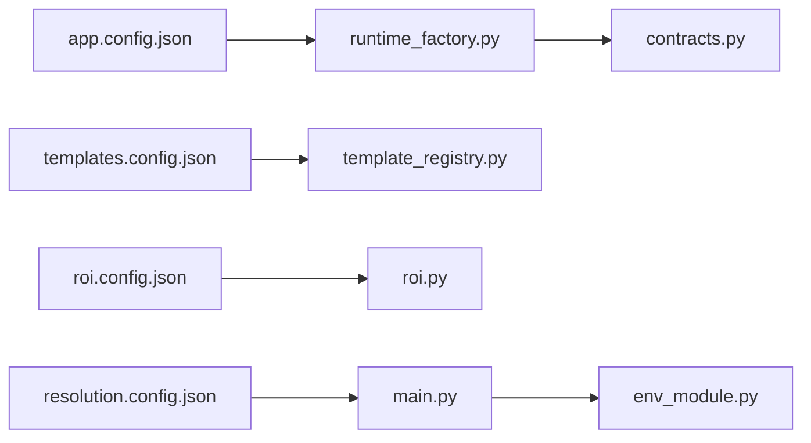

# 配置系统

<cite>
**本文引用的文件**
- [app.config.json](file://config/app.config.json)
- [templates.config.json](file://config/templates.config.json)
- [roi.config.json](file://config/roi.config.json)
- [resolution.config.json](file://config/resolution.config.json)
- [main.py](file://src/main.py)
- [runtime_factory.py](file://src/core/runtime_factory.py)
- [contracts.py](file://src/vision/contracts.py)
- [template_registry.py](file://src/vision/template_registry.py)
- [roi.py](file://src/vision/roi.py)
- [env_module.py](file://src/modules/env_module.py)
- [test_ocr.py](file://tools/test_ocr.py)
- [calibrate_roi.py](file://tools/calibrate_roi.py)
- [capture_roi.py](file://tools/capture_roi.py)
- [collect_template.py](file://tools/collect_template.py)
</cite>

## 目录
1. [简介](#简介)
2. [项目结构](#项目结构)
3. [核心组件](#核心组件)
4. [架构总览](#架构总览)
5. [详细组件分析](#详细组件分析)
6. [依赖关系分析](#依赖关系分析)
7. [性能考虑](#性能考虑)
8. [故障排查指南](#故障排查指南)
9. [结论](#结论)
10. [附录](#附录)

## 简介
本参考文档面向配置系统，覆盖应用主配置、模板配置、ROI（感兴趣区域）配置与分辨率配置的参数说明、使用方式与最佳实践。同时提供配置验证与调试工具的使用指引，帮助开发者快速定位并解决配置问题，优化运行稳定性与性能。

## 项目结构
配置系统由四份 JSON 配置文件构成，分别控制运行时行为、视觉识别、屏幕区域与显示设置：
- 应用主配置：定义运行模式、日志与截图路径、OCR 参数、模板与 ROI 配置路径、平台校验阈值等。
- 模板配置：声明模板名称、文件路径、绑定的 ROI 名称、匹配阈值与描述。
- ROI 配置：以坐标与尺寸定义多个屏幕区域，供模板匹配与 OCR 裁剪使用。
- 分辨率配置：定义目标分辨率、窗口模式、UI 缩放与语言。

图表来源
- [main.py:22-50](file://src/main.py#L22-L50)
- [runtime_factory.py:30-77](file://src/core/runtime_factory.py#L30-L77)
- [template_registry.py:17-44](file://src/vision/template_registry.py#L17-L44)
- [roi.py:21-68](file://src/vision/roi.py#L21-L68)
- [contracts.py:119-251](file://src/vision/contracts.py#L119-L251)
- [env_module.py:23-88](file://src/modules/env_module.py#L23-L88)

章节来源
- [main.py:22-50](file://src/main.py#L22-L50)
- [runtime_factory.py:30-77](file://src/core/runtime_factory.py#L30-L77)

## 核心组件
- 应用主配置（app.config.json）
  - 运行时模式：决定使用 Windows 真实适配层或 DryRun 模拟层。
  - 重试与超时：状态重试次数与单状态超时时间，用于流程控制与容错。
  - 输出目录：日志、截图、调试图片的保存位置。
  - 窗口关键词：用于定位目标游戏窗口进行截图与输入。
  - OCR 参数：语言、PSM 模式、Tesseract 可执行命令。
  - 模板与 ROI 路径：模板根目录、模板配置文件路径、ROI 配置文件路径。
  - 平台校验阈值：截图检查次数、模板匹配阈值、OCR 置信度阈值、输入成功阈值。
- 模板配置（templates.config.json）
  - 每个模板项包含：模板文件相对路径、绑定的 ROI 名称、匹配阈值、描述。
  - 通过模板注册表加载并解析为模板定义对象，供匹配器使用。
- ROI 配置（roi.config.json）
  - 每个区域项包含：左上角坐标 x/y、宽度 width、高度 height、可选描述。
  - 通过 ROI 仓库加载，支持读取、写入与更新。
- 分辨率配置（resolution.config.json）
  - 目标分辨率、窗口模式、UI 缩放、语言。
  - 在启动时记录到日志，便于确认当前运行环境。

章节来源
- [app.config.json:1-23](file://config/app.config.json#L1-L23)
- [templates.config.json:1-9](file://config/templates.config.json#L1-L9)
- [roi.config.json:1-31](file://config/roi.config.json#L1-L31)
- [resolution.config.json:1-8](file://config/resolution.config.json#L1-L8)
- [template_registry.py:17-44](file://src/vision/template_registry.py#L17-L44)
- [roi.py:21-68](file://src/vision/roi.py#L21-L68)
- [main.py:22-50](file://src/main.py#L22-L50)

## 架构总览
启动流程中，应用主配置与分辨率配置被加载，随后根据运行模式构建运行时适配器，装配截图、模板匹配、OCR 与输入控制器。平台验证模块基于配置中的阈值对各项能力进行自检。

图表来源
- [main.py:22-50](file://src/main.py#L22-L50)
- [runtime_factory.py:30-77](file://src/core/runtime_factory.py#L30-L77)
- [env_module.py:23-88](file://src/modules/env_module.py#L23-L88)
- [contracts.py:119-251](file://src/vision/contracts.py#L119-L251)

## 详细组件分析

### 应用主配置（app.config.json）
- 运行时模式（runtime_mode）
  - 值：字符串，如 windows 或 dry_run。
  - 作用：决定构建 Windows 适配层或 DryRun 模拟层。
- 重试与超时
  - max_state_retry：状态机重试上限。
  - state_timeout_sec：单状态最大等待秒数。
- 输出目录
  - log_dir：日志目录。
  - screenshot_dir：截图目录。
  - debug_dir：调试图片目录（默认与截图目录相同）。
- 窗口关键词（window_title_keyword）
  - 用于定位目标窗口进行截图与输入。
- OCR 参数
  - ocr_language：OCR 语言代码。
  - ocr_psm：Tesseract PSM 模式。
  - ocr_tesseract_cmd：Tesseract 可执行命令或路径。
- 模板与 ROI 路径
  - template_root：模板文件根目录。
  - template_config_path：模板配置文件路径。
  - roi_config_path：ROI 配置文件路径。
- 平台校验阈值（platform_validation）
  - screenshot_check_count：截图检查次数。
  - template_match_threshold：模板匹配阈值。
  - ocr_confidence_threshold：OCR 置信度阈值。
  - input_success_threshold：输入操作成功阈值。

章节来源
- [app.config.json:1-23](file://config/app.config.json#L1-L23)
- [runtime_factory.py:30-77](file://src/core/runtime_factory.py#L30-L77)

### 模板配置（templates.config.json）
- 模板定义字段
  - path：模板文件相对路径（相对于 template_root）。
  - roi：绑定的 ROI 名称（可选），用于限定匹配区域以提升性能与准确性。
  - threshold：匹配阈值，低于该值视为未命中。
  - description：模板用途说明。
- 加载与校验
  - 模板注册表会校验配置文件存在性、模板名存在性、模板文件存在性。
  - 若绑定 ROI 越界，匹配器返回未命中并附带错误信息，避免异常中断。

图表来源
- [template_registry.py:17-44](file://src/vision/template_registry.py#L17-L44)

章节来源
- [templates.config.json:1-9](file://config/templates.config.json#L1-L9)
- [template_registry.py:17-44](file://src/vision/template_registry.py#L17-L44)
- [contracts.py:119-186](file://src/vision/contracts.py#L119-L186)

### ROI 配置（roi.config.json）
- 区域定义字段
  - x、y：左上角坐标。
  - width、height：区域宽高。
  - description：区域用途说明（可选）。
- 坐标系统与尺寸
  - 坐标以像素为单位，原点在图像左上角。
  - 区域必须位于图像范围内；越界会导致匹配跳过或警告。
- 使用方式
  - 通过 ROI 仓库加载所有区域，按名称获取单个区域。
  - 支持 upsert 写入新区域或更新现有区域，自动持久化到 JSON。

图表来源
- [roi.py:8-68](file://src/vision/roi.py#L8-L68)

章节来源
- [roi.config.json:1-31](file://config/roi.config.json#L1-L31)
- [roi.py:21-68](file://src/vision/roi.py#L21-L68)

### 分辨率配置（resolution.config.json）
- 字段说明
  - width、height：目标分辨率。
  - window_mode：窗口模式（如窗口化全屏）。
  - ui_scale：UI 缩放比例。
  - language：界面语言。
- 作用
  - 启动时记录到日志，便于确认当前运行环境与显示设置。
  - 配合 ROI 标定与模板采集，确保截图与识别区域一致。

章节来源
- [resolution.config.json:1-8](file://config/resolution.config.json#L1-L8)
- [main.py:22-50](file://src/main.py#L22-L50)

### 运行时适配器与平台验证
- 运行时适配器（runtime_factory.py）
  - 根据 app.config.json 中的运行模式选择 Windows 或 DryRun 适配层。
  - 注入模板根目录、模板配置路径、ROI 配置路径、OCR 参数与窗口关键词。
- 平台验证（env_module.py）
  - 依次执行截图、模板匹配、OCR 文本识别、输入操作。
  - 使用 platform_validation 中的阈值判断各链路是否通过。
  - 生成验证报告，包含通过状态、截图路径、错误列表与下一步建议。

图表来源
- [runtime_factory.py:30-77](file://src/core/runtime_factory.py#L30-L77)
- [env_module.py:23-88](file://src/modules/env_module.py#L23-L88)
- [contracts.py:101-251](file://src/vision/contracts.py#L101-L251)

章节来源
- [runtime_factory.py:30-77](file://src/core/runtime_factory.py#L30-L77)
- [env_module.py:23-88](file://src/modules/env_module.py#L23-L88)
- [contracts.py:101-251](file://src/vision/contracts.py#L101-L251)

## 依赖关系分析
- 配置到实现的映射
  - app.config.json → runtime_factory.py：决定适配层与参数注入。
  - templates.config.json → template_registry.py：模板定义与路径解析。
  - roi.config.json → roi.py：区域加载与持久化。
  - resolution.config.json → main.py：启动日志与环境确认。
- 运行时依赖
  - contracts.py 提供 Windows 与 DryRun 两套实现，统一接口。
  - env_module.py 依赖上述提供者进行端到端验证。

图表来源
- [main.py:22-50](file://src/main.py#L22-L50)
- [runtime_factory.py:30-77](file://src/core/runtime_factory.py#L30-L77)
- [template_registry.py:17-44](file://src/vision/template_registry.py#L17-L44)
- [roi.py:21-68](file://src/vision/roi.py#L21-L68)
- [env_module.py:23-88](file://src/modules/env_module.py#L23-L88)

章节来源
- [main.py:22-50](file://src/main.py#L22-L50)
- [runtime_factory.py:30-77](file://src/core/runtime_factory.py#L30-L77)
- [template_registry.py:17-44](file://src/vision/template_registry.py#L17-L44)
- [roi.py:21-68](file://src/vision/roi.py#L21-L68)
- [env_module.py:23-88](file://src/modules/env_module.py#L23-L88)

## 性能考虑
- 使用 ROI 限制匹配范围
  - 模板绑定 ROI 后，仅在指定区域内匹配，减少大图搜索开销。
  - 若 ROI 越界，匹配器返回未命中并附带错误信息，避免异常中断。
- 合理设置阈值
  - 模板匹配阈值与 OCR 置信度阈值需结合样本数据调优，避免误报或漏报。
- 输出目录管理
  - 将截图与调试图集中保存到固定目录，便于批量分析与自动化处理。
- 运行模式选择
  - 开发阶段可使用 DryRun 模式快速验证流程；稳定后再切换到 Windows 真实适配层。

[本节为通用指导，不直接分析具体文件]

## 故障排查指南
- 平台验证失败
  - 检查截图链路：确认窗口关键词能命中目标窗口，截图目录可写。
  - 检查模板匹配：确认模板文件存在、ROI 名称正确且未越界。
  - 检查 OCR 链路：确认 Tesseract 可执行命令可用、语言与 PSM 设置正确。
  - 检查输入链路：确认点击与按键操作返回成功。
- 常见问题定位
  - ROI 越界：模板匹配返回未命中并附带 roi_out_of_bounds 错误信息。
  - 模板文件缺失：模板注册表抛出文件不存在错误。
  - 配置路径错误：模板或 ROI 配置文件路径不正确导致加载失败。
- 调试工具使用
  - OCR 测试工具：支持从已有截图或实时窗口截图，按 ROI 裁切、预处理、调用 Tesseract 识别，输出文本、置信度与调试图路径。
  - ROI 校准工具：写入或更新 ROI 配置，支持名称、坐标与尺寸。
  - ROI 裁切工具：从截图中按 ROI 裁切并保存为新 BMP。
  - 模板采集工具：从截图中按 ROI 采集模板并保存到模板目录。

章节来源
- [env_module.py:23-88](file://src/modules/env_module.py#L23-L88)
- [contracts.py:119-186](file://src/vision/contracts.py#L119-L186)
- [test_ocr.py:26-181](file://tools/test_ocr.py#L26-L181)
- [calibrate_roi.py:14-47](file://tools/calibrate_roi.py#L14-L47)
- [capture_roi.py:15-42](file://tools/capture_roi.py#L15-L42)
- [collect_template.py:15-42](file://tools/collect_template.py#L15-L42)

## 结论
配置系统通过四份 JSON 配置文件与相应的加载与适配逻辑，实现了运行模式、视觉识别、屏幕区域与显示设置的集中化管理。配合平台验证与调试工具，开发者可以快速定位配置问题并优化性能与稳定性。建议在固定环境下完成 ROI 标定与模板采集，合理设置阈值，并使用 ROI 限制匹配范围以提升效率。

[本节为总结，不直接分析具体文件]

## 附录
- 配置项速查
  - 应用主配置：运行时模式、重试与超时、输出目录、窗口关键词、OCR 参数、模板与 ROI 路径、平台校验阈值。
  - 模板配置：模板路径、ROI 绑定、匹配阈值、描述。
  - ROI 配置：坐标与尺寸、描述。
  - 分辨率配置：分辨率、窗口模式、UI 缩放、语言。
- 推荐工作流
  - 使用分辨率配置固定显示设置。
  - 使用 ROI 校准工具标定区域。
  - 使用模板采集工具采集模板。
  - 使用 OCR 测试工具验证识别效果。
  - 运行平台验证模块进行端到端自检。

[本节为补充信息，不直接分析具体文件]