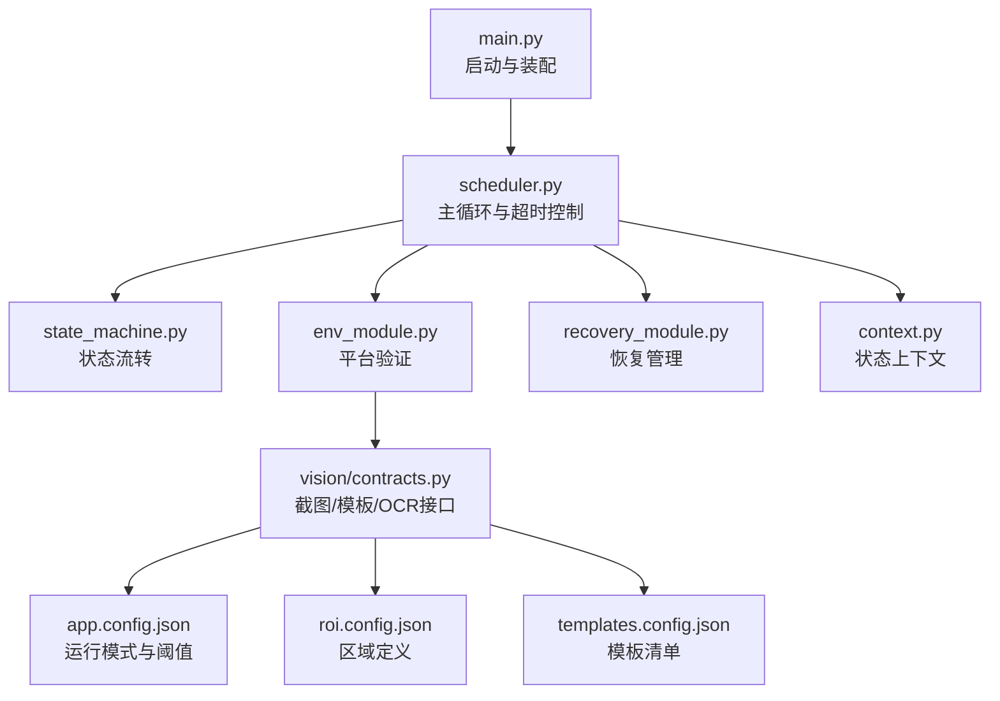
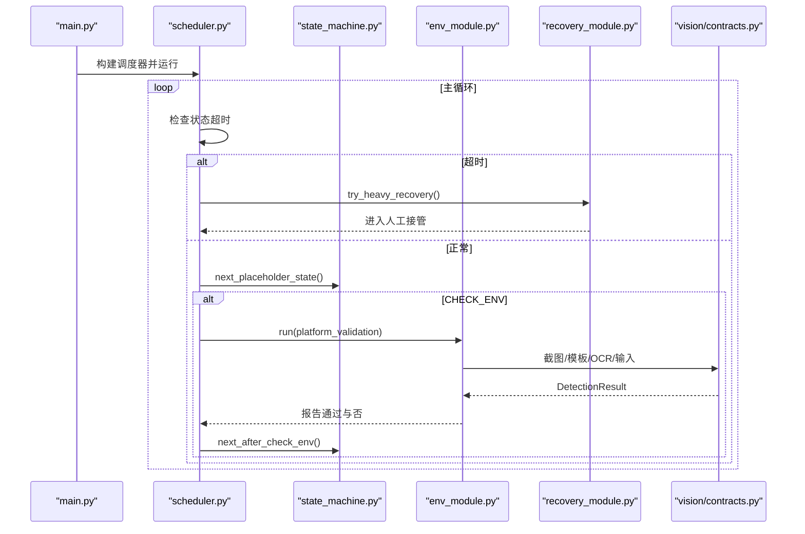
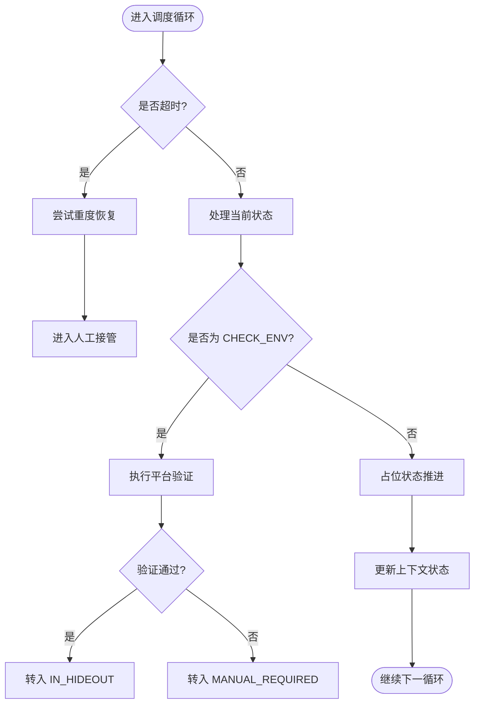
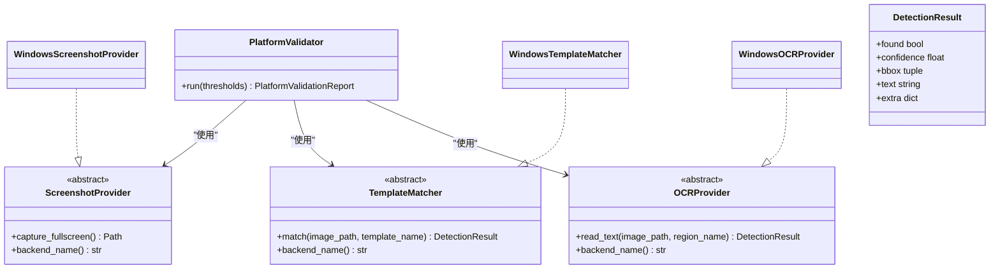
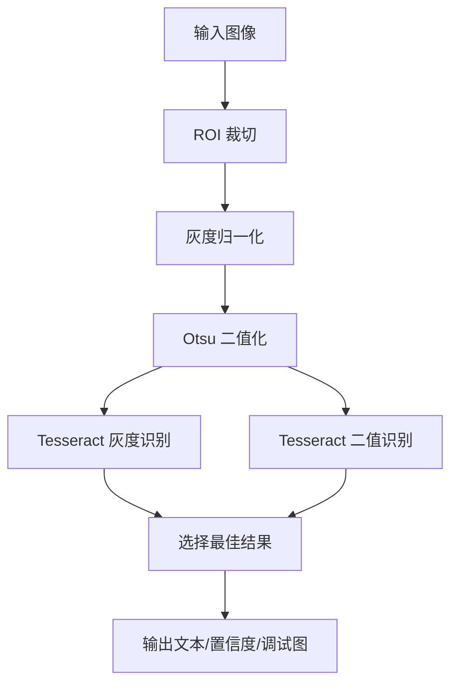
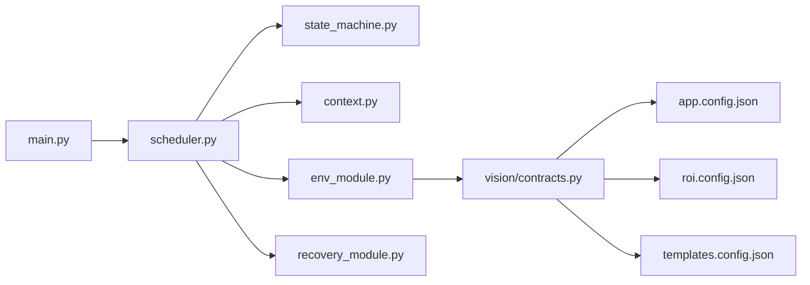

# 开发路线图

<cite>
**本文引用的文件**
- [README.md](file://README.md)
- [technical.plan.md](file://technical.plan.md)
- [development.status.md](file://development.status.md)
- [src/main.py](file://src/main.py)
- [src/core/scheduler.py](file://src/core/scheduler.py)
- [src/core/state_machine.py](file://src/core/state_machine.py)
- [src/core/context.py](file://src/core/context.py)
- [src/vision/contracts.py](file://src/vision/contracts.py)
- [config/app.config.json](file://config/app.config.json)
- [config/roi.config.json](file://config/roi.config.json)
- [config/templates.config.json](file://config/templates.config.json)
- [tools/test_ocr.py](file://tools/test_ocr.py)
- [src/modules/env_module.py](file://src/modules/env_module.py)
- [src/modules/recovery_module.py](file://src/modules/recovery_module.py)
</cite>

## 目录
1. [引言](#引言)
2. [项目结构](#项目结构)
3. [核心组件](#核心组件)
4. [架构总览](#架构总览)
5. [详细组件分析](#详细组件分析)
6. [依赖关系分析](#依赖关系分析)
7. [性能与稳定性考量](#性能与稳定性考量)
8. [故障排查指南](#故障排查指南)
9. [版本发布计划与兼容性策略](#版本发布计划与兼容性策略)
10. [贡献者参与指南](#贡献者参与指南)
11. [里程碑与进度图](#里程碑与进度图)
12. [结论](#结论)

## 引言
本路线图面向“流放之路自动挂贪婪脚本”项目，目标是从平台验证逐步演进到完整闭环自动化。当前处于 M0：平台可行性阶段，已完成截图、输入、ROI、模板匹配、OCR 的基础实现，等待安装 Tesseract 后进行首次真实验证。后续将按 M1（稳定进图）、M2（祭坛交互）、M3（安全收尾）、M4（完整闭环）分阶段推进，并在每个阶段明确技术挑战、解决方案与验收标准。

## 项目结构
项目采用分层架构，职责清晰：调度层驱动主循环，状态层维护状态机，识别层负责截图、ROI、模板匹配与 OCR，行为层封装输入动作，策略层承载业务规则，监控层记录日志与关键数据，标定与数据层管理 ROI、模板与调试素材。入口通过 main 装配运行时适配器，调度器根据上下文和配置驱动状态流转与环境校验。



图表来源
- [src/main.py:22-50](file://src/main.py#L22-L50)
- [src/core/scheduler.py:13-47](file://src/core/scheduler.py#L13-L47)
- [src/core/state_machine.py:6-41](file://src/core/state_machine.py#L6-L41)
- [src/modules/env_module.py:23-87](file://src/modules/env_module.py#L23-L87)
- [src/vision/contracts.py:25-55](file://src/vision/contracts.py#L25-L55)
- [config/app.config.json:1-22](file://config/app.config.json#L1-L22)
- [config/roi.config.json:1-31](file://config/roi.config.json#L1-L31)
- [config/templates.config.json:1-9](file://config/templates.config.json#L1-L9)

章节来源
- [src/main.py:22-50](file://src/main.py#L22-L50)
- [src/core/scheduler.py:13-47](file://src/core/scheduler.py#L13-L47)
- [src/core/context.py:10-62](file://src/core/context.py#L10-L62)
- [src/vision/contracts.py:25-55](file://src/vision/contracts.py#L25-L55)
- [config/app.config.json:1-22](file://config/app.config.json#L1-L22)

## 核心组件
- 调度器：维护主循环、超时与重试守卫，调用状态机与环境校验，处理人工接管与停止。
- 状态机：定义状态列表与流转规则，支持占位流程顺序推进。
- 上下文：统一维护当前状态、轮次、置信度、截图路径等元数据。
- 平台验证：串联截图、模板匹配、OCR、输入链路，输出通过与否与建议。
- 恢复管理器：提供轻/中/重恢复接口，失败时进入人工接管。
- 视觉适配：提供截图、模板匹配、OCR 的 Windows 实现与 DryRun 占位。
- 工具：独立 OCR 测试脚本用于快速验证预处理与识别链路。

章节来源
- [src/core/scheduler.py:13-83](file://src/core/scheduler.py#L13-L83)
- [src/core/state_machine.py:6-41](file://src/core/state_machine.py#L6-L41)
- [src/core/context.py:10-62](file://src/core/context.py#L10-L62)
- [src/modules/env_module.py:11-87](file://src/modules/env_module.py#L11-L87)
- [src/modules/recovery_module.py:6-19](file://src/modules/recovery_module.py#L6-L19)
- [src/vision/contracts.py:25-251](file://src/vision/contracts.py#L25-L251)
- [tools/test_ocr.py:26-181](file://tools/test_ocr.py#L26-L181)

## 架构总览
系统以“调度 + 状态机 + 识别 + 行为 + 恢复”为核心，配合配置驱动的 ROI 与模板，形成可插拔的运行时适配层。调度器在每次循环中检查超时并驱动状态机；环境校验在 CHECK_ENV 阶段执行，通过后进入 IN_HIDEOUT 开始业务流；异常或未知状态触发恢复或人工接管。



图表来源
- [src/main.py:22-50](file://src/main.py#L22-L50)
- [src/core/scheduler.py:32-83](file://src/core/scheduler.py#L32-L83)
- [src/core/state_machine.py:6-41](file://src/core/state_machine.py#L6-L41)
- [src/modules/env_module.py:38-87](file://src/modules/env_module.py#L38-L87)
- [src/vision/contracts.py:25-251](file://src/vision/contracts.py#L25-L251)

## 详细组件分析

### 调度器与状态机
调度器负责主循环、超时检测与恢复触发；状态机定义从 BOOTSTRAP 到 STOPPED 的流转逻辑，并在 dry_run 模式下按固定顺序推进占位状态。CHECK_ENV 阶段调用平台验证，根据结果决定进入 IN_HIDEOUT 或 MANUAL_REQUIRED。



图表来源
- [src/core/scheduler.py:32-83](file://src/core/scheduler.py#L32-L83)
- [src/core/state_machine.py:6-41](file://src/core/state_machine.py#L6-L41)

章节来源
- [src/core/scheduler.py:32-83](file://src/core/scheduler.py#L32-L83)
- [src/core/state_machine.py:6-41](file://src/core/state_machine.py#L6-L41)

### 平台验证与视觉适配
平台验证串联截图、模板匹配、OCR、输入四项能力，逐项捕获异常并生成建议。视觉适配提供 Windows 真实实现与 DryRun 占位，模板匹配支持 ROI 裁剪与越界保护，OCR 提供灰度/二值双路识别与调试图输出。



图表来源
- [src/modules/env_module.py:11-87](file://src/modules/env_module.py#L11-L87)
- [src/vision/contracts.py:16-55](file://src/vision/contracts.py#L16-L55)
- [src/vision/contracts.py:101-251](file://src/vision/contracts.py#L101-L251)

章节来源
- [src/modules/env_module.py:38-87](file://src/modules/env_module.py#L38-L87)
- [src/vision/contracts.py:101-251](file://src/vision/contracts.py#L101-L251)

### OCR 预处理与测试
OCR 模块对 ROI 裁切后的图像进行灰度归一化与 Otsu 自适应二值化，分别调用 Tesseract 后端并选择最佳结果，同时保存原图、灰度图、二值图用于调试。独立测试脚本支持传入已有截图或实时窗口截图，便于离线验证与参数调优。



图表来源
- [src/vision/contracts.py:188-251](file://src/vision/contracts.py#L188-L251)
- [tools/test_ocr.py:57-181](file://tools/test_ocr.py#L57-L181)

章节来源
- [tools/test_ocr.py:57-181](file://tools/test_ocr.py#L57-L181)
- [src/vision/contracts.py:188-251](file://src/vision/contracts.py#L188-L251)

## 依赖关系分析
- 入口 main 装配运行时适配器，注入平台验证与恢复管理器，创建调度器。
- 调度器依赖状态机与上下文，CHECK_ENV 阶段依赖平台验证。
- 平台验证依赖截图、模板匹配、OCR、输入控制器。
- 视觉适配依赖 ROI 与模板配置，模板匹配支持 ROI 越界保护。
- OCR 依赖 Tesseract 外部命令与语言/PSM 配置。



图表来源
- [src/main.py:22-50](file://src/main.py#L22-L50)
- [src/core/scheduler.py:13-47](file://src/core/scheduler.py#L13-L47)
- [src/modules/env_module.py:23-87](file://src/modules/env_module.py#L23-L87)
- [src/vision/contracts.py:25-55](file://src/vision/contracts.py#L25-L55)
- [config/app.config.json:1-22](file://config/app.config.json#L1-L22)
- [config/roi.config.json:1-31](file://config/roi.config.json#L1-L31)
- [config/templates.config.json:1-9](file://config/templates.config.json#L1-L9)

章节来源
- [src/main.py:22-50](file://src/main.py#L22-L50)
- [src/core/scheduler.py:13-47](file://src/core/scheduler.py#L13-L47)
- [src/modules/env_module.py:23-87](file://src/modules/env_module.py#L23-L87)
- [src/vision/contracts.py:25-55](file://src/vision/contracts.py#L25-L55)

## 性能与稳定性考量
- 模板匹配当前为纯 Python 暴力匹配，适合小 ROI、小模板验证；后续应引入 OpenCV 或更高效算法以提升性能。
- OCR 双路识别（灰度/二值）提升鲁棒性，但需关注 Tesseract 调用开销与预处理质量。
- 状态机与超时守卫避免无限重试，结合恢复管理器限制恢复深度，优先安全停机。
- ROI 越界保护防止分辨率不一致导致的崩溃，返回不命中而非异常。
- 日志与调试图沉淀有助于定位性能瓶颈与识别失败原因。

[本节为通用指导，无需特定文件引用]

## 故障排查指南
- 截图失败：检查窗口标题关键词、客户区截图路径与权限，确认 find_window 与 capture_window_client_area 可用。
- 模板匹配失败：核对模板路径、阈值与 ROI 绑定，确认 ROI 未越界；查看 extra 中的模板描述与错误信息。
- OCR 失败：确认 Tesseract 已安装并可执行，检查语言与 PSM 设置；查看调试图（原图/灰度/二值）评估预处理效果。
- 输入失败：检查坐标是否在有效范围内，确认目标窗口焦点与权限；记录点击与按键返回值。
- 状态卡住：查看上下文的重试次数与状态耗时，必要时触发恢复或人工接管。

章节来源
- [src/vision/contracts.py:101-185](file://src/vision/contracts.py#L101-L185)
- [src/vision/contracts.py:188-251](file://src/vision/contracts.py#L188-L251)
- [src/modules/env_module.py:38-87](file://src/modules/env_module.py#L38-L87)
- [src/core/scheduler.py:32-83](file://src/core/scheduler.py#L32-L83)

## 版本发布计划与兼容性策略
- 第一版严格固定环境：分辨率、窗口模式、UI 缩放、语言、地图类型、圣甲虫组合、角色技能方案、背包布局、仓库页、过滤器规则。
- MVP 范围：人工提前准备地图与圣甲虫，脚本自动进图、巡逻、识别并交互一次贪婪祭坛，成功后回城或安全停机。
- 验收指标：截图成功率、模板识别成功率、OCR 识别成功率、进图成功率、祭坛发现与交互成功率、平均搜索时间、卡住恢复成功率、安全停机成功率、连续运行轮数。
- 兼容性策略：先固定后兼容；模板与 ROI 随游戏更新回归对比；OCR 样本持续积累；多信号交叉确认关键状态。

章节来源
- [README.md:47-90](file://README.md#L47-L90)
- [README.md:126-157](file://README.md#L126-L157)
- [README.md:229-243](file://README.md#L229-L243)

## 贡献者参与指南
- 遵循需求文档与技术方案的边界与原则：先验证平台，再验证业务；每一步必须有成功校验；状态不确定优先停机。
- 开发顺序参考技术方案的任务清单：平台可行性 → 状态机骨架 → 地图装置链路 → 地图内移动链路 → 祭坛链路 → 安全收尾 → 完整闭环。
- 提交前确保：日志与截图落盘、ROI 与模板配置更新、单元测试与工具脚本可用。
- 遇到阻塞点（如 Tesseract 未安装、缺少真实模板）优先解决基础设施问题，再继续业务模块。

章节来源
- [technical.plan.md:13-42](file://technical.plan.md#L13-L42)
- [technical.plan.md:534-619](file://technical.plan.md#L534-L619)
- [development.status.md:213-239](file://development.status.md#L213-L239)

## 里程碑与进度图
当前进度：M0 平台可行性阶段，OCR 实现已补齐，等待安装 Tesseract 后进行首次真实验证。下一步重点：完成真实截图稳定性、输入成功率、模板识别成功率与 OCR 可用性验证，随后进入 M1 稳定进图。

```mermaid
gantt
title 开发里程碑与进度
dateFormat YYYY-MM-DD
axisFormat %m/%d
section 基础能力
平台验证(M0) :done, m0, 2026-05-01, 2026-05-20
截图服务 :done, s1, 2026-05-01, 2026-05-15
模板匹配 :done, t1, 2026-05-05, 2026-05-18
OCR 预处理与后端 :done, o1, 2026-05-10, 2026-05-20
section 业务流程
稳定进图(M1) :active, m1, 2026-05-21, 2026-06-10
祭坛交互(M2) :future, m2, 2026-06-11, 2026-07-10
安全收尾(M3) :future, m3, 2026-07-11, 2026-08-10
完整闭环(M4) :future, m4, 2026-08-11, 2026-09-10
```

图表来源
- [development.status.md:29-68](file://development.status.md#L29-L68)
- [README.md:126-157](file://README.md#L126-L157)

章节来源
- [development.status.md:29-68](file://development.status.md#L29-L68)
- [README.md:126-157](file://README.md#L126-L157)

## 结论
项目已从“DryRun 骨架”切换到“Windows 真实链路”，M0 大部分基础设施已完成，OCR 实现补齐，待 Tesseract 安装后进行首次真实验证。下一阶段聚焦稳定进图与地图内目标识别，严格遵循状态机与恢复约束，确保每一步可校验、可回放、可止损。随着模板与 ROI 数据积累以及识别能力提升，逐步扩展至完整闭环自动化。

[本节为总结，无需特定文件引用]