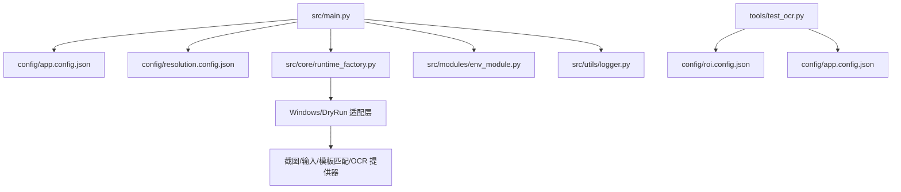
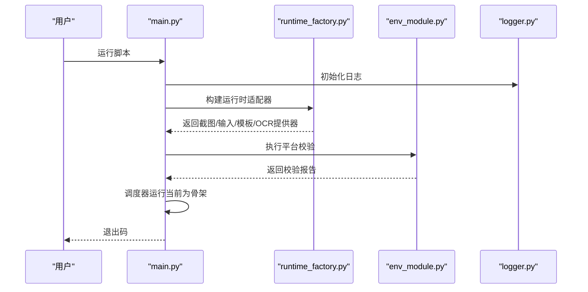
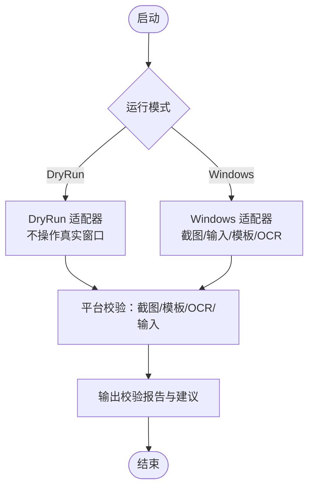
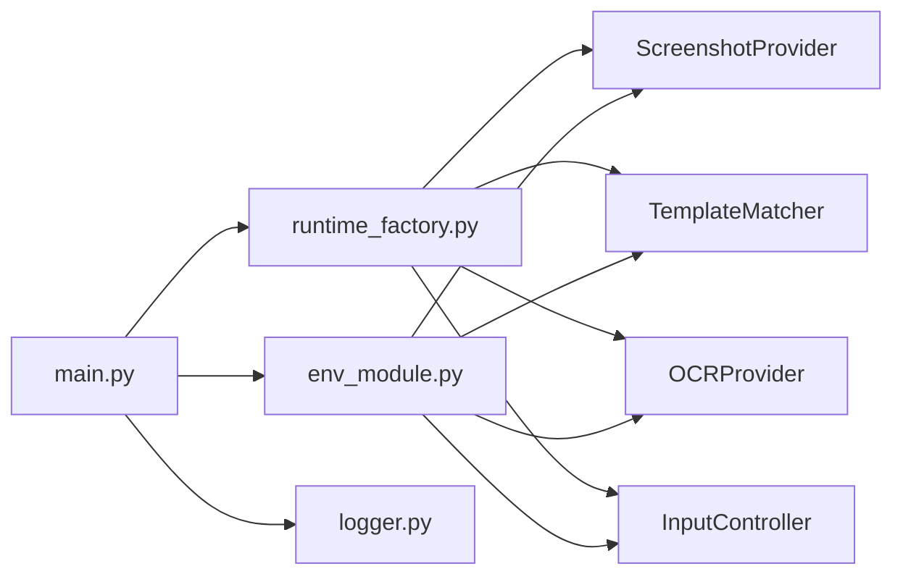

# 快速开始指南

<cite>
**本文引用的文件**
- [README.md](file://README.md)
- [technical.plan.md](file://technical.plan.md)
- [development.status.md](file://development.status.md)
- [src/main.py](file://src/main.py)
- [config/app.config.json](file://config/app.config.json)
- [config/resolution.config.json](file://config/resolution.config.json)
- [config/roi.config.json](file://config/roi.config.json)
- [config/templates.config.json](file://config/templates.config.json)
- [src/core/context.py](file://src/core/context.py)
- [src/core/runtime_factory.py](file://src/core/runtime_factory.py)
- [src/modules/env_module.py](file://src/modules/env_module.py)
- [src/utils/logger.py](file://src/utils/logger.py)
- [tools/test_ocr.py](file://tools/test_ocr.py)
- [tools/capture_roi.py](file://tools/capture_roi.py)
</cite>

## 目录
1. [简介](#简介)
2. [项目结构](#项目结构)
3. [核心组件](#核心组件)
4. [架构总览](#架构总览)
5. [详细组件分析](#详细组件分析)
6. [依赖关系分析](#依赖关系分析)
7. [性能与资源监控](#性能与资源监控)
8. [故障排查](#故障排查)
9. [结论](#结论)
10. [附录：30分钟上手清单](#附录30分钟上手清单)

## 简介
本快速开始指南面向首次接触“流放之路自动挂贪婪脚本”的新用户，目标是帮助你在30分钟内完成环境搭建、配置准备并成功运行第一个自动化任务。本项目采用“先验证平台能力，再逐步实现业务”的策略，当前处于M0阶段（平台可行性），已具备截图、输入、ROI标定、模板匹配、OCR等基础能力，并通过DryRun模式支持安全调试。

## 项目结构
仓库采用分层组织方式，核心目录职责如下：
- config：应用、分辨率、ROI、模板等配置文件
- src：主程序入口、调度、状态机、运行时装配、模块、工具、视觉识别、输入控制
- tools：ROI标定、裁切、模板采集、OCR测试等辅助脚本
- assets：模板图片等资源

图表来源
- [src/main.py:22-50](file://src/main.py#L22-L50)
- [src/core/runtime_factory.py:30-77](file://src/core/runtime_factory.py#L30-L77)
- [src/modules/env_module.py:23-88](file://src/modules/env_module.py#L23-L88)
- [tools/test_ocr.py:26-50](file://tools/test_ocr.py#L26-L50)

章节来源
- [src/main.py:22-50](file://src/main.py#L22-L50)
- [config/app.config.json:1-23](file://config/app.config.json#L1-L23)
- [config/resolution.config.json:1-8](file://config/resolution.config.json#L1-L8)
- [config/roi.config.json:1-31](file://config/roi.config.json#L1-L31)
- [config/templates.config.json:1-9](file://config/templates.config.json#L1-L9)

## 核心组件
- 启动与装配：main负责加载配置、创建日志、构建运行时适配器、组装平台校验器与调度器。
- 运行时适配器：根据运行模式选择真实Windows适配或DryRun占位实现，统一注入截图、输入、模板匹配、OCR能力。
- 平台校验：对截图、模板匹配、OCR、输入进行链路验证，输出通过/失败与建议。
- 状态上下文：维护脚本状态、重试计数、超时、截图路径等上下文信息。
- 日志系统：统一控制台与文件日志输出，便于问题定位。

章节来源
- [src/main.py:22-50](file://src/main.py#L22-L50)
- [src/core/runtime_factory.py:30-77](file://src/core/runtime_factory.py#L30-L77)
- [src/modules/env_module.py:23-88](file://src/modules/env_module.py#L23-L88)
- [src/core/context.py:10-62](file://src/core/context.py#L10-L62)
- [src/utils/logger.py:11-40](file://src/utils/logger.py#L11-L40)

## 架构总览
整体采用“调度层-状态层-识别层-行为层-策略层-监控层-标定数据层”的分层设计，当前已实现调度骨架、状态上下文、识别与行为的DryRun/Windows双适配、平台校验与日志记录。

图表来源
- [src/main.py:22-50](file://src/main.py#L22-L50)
- [src/core/runtime_factory.py:30-77](file://src/core/runtime_factory.py#L30-L77)
- [src/modules/env_module.py:38-88](file://src/modules/env_module.py#L38-L88)
- [src/utils/logger.py:11-40](file://src/utils/logger.py#L11-L40)

## 详细组件分析

### 环境与配置快速设置
- Python版本要求：建议使用Python 3.9+（确保标准库与第三方库兼容）。
- 依赖安装：按requirements（如有）安装；若未提供，优先安装Tesseract OCR及系统依赖。
- Tesseract OCR配置：
  - 在app.config.json中配置ocr_tesseract_cmd、ocr_language、ocr_psm。
  - 使用tools/test_ocr.py独立验证OCR链路。
- 分辨率与窗口模式：
  - 在resolution.config.json中固定width、height、window_mode、ui_scale、language。
- ROI区域：
  - 在roi.config.json中定义debug_label、hideout_anchor、map_device_panel等区域，用于截图裁剪与识别。
- 模板配置：
  - 在templates.config.json中注册模板名称、路径、阈值、绑定ROI等。

章节来源
- [config/app.config.json:1-23](file://config/app.config.json#L1-L23)
- [config/resolution.config.json:1-8](file://config/resolution.config.json#L1-L8)
- [config/roi.config.json:1-31](file://config/roi.config.json#L1-L31)
- [config/templates.config.json:1-9](file://config/templates.config.json#L1-L9)
- [tools/test_ocr.py:26-50](file://tools/test_ocr.py#L26-L50)

### 第一个自动化任务：从DryRun到真实Windows
- DryRun模式（不影响游戏）：
  - 将app.config.json的runtime_mode设置为dry_run。
  - 运行脚本可完整走通占位流程，验证调度与日志。
- Windows真实模式：
  - 将runtime_mode设置为windows。
  - 配置window_title_keyword以匹配游戏窗口标题关键词。
  - 运行脚本后，PlatformValidator会尝试截图、模板匹配、OCR、输入，并输出报告。

图表来源
- [src/core/runtime_factory.py:30-77](file://src/core/runtime_factory.py#L30-L77)
- [src/modules/env_module.py:38-88](file://src/modules/env_module.py#L38-L88)

章节来源
- [src/core/runtime_factory.py:30-77](file://src/core/runtime_factory.py#L30-L77)
- [src/modules/env_module.py:38-88](file://src/modules/env_module.py#L38-L88)

### 地图装置操作流程（M1）
- 目标：稳定打开地图装置、放入地图与圣甲虫、激活地图、进入传送门。
- 前置条件：
  - 固定分辨率与窗口模式。
  - ROI中已标定map_device_panel区域。
  - 模板中已注册地图装置相关UI元素。
- 步骤建议：
  - 使用模板匹配确认地图装置界面出现。
  - 使用输入控制器点击地图槽位、圣甲虫槽位、激活按钮。
  - 使用模板匹配确认传送门生成后点击进入。
  - 每步动作后进行结果校验与超时处理。

章节来源
- [config/roi.config.json:16-22](file://config/roi.config.json#L16-L22)
- [config/templates.config.json:1-9](file://config/templates.config.json#L1-L9)
- [src/core/context.py:10-29](file://src/core/context.py#L10-L29)

### OCR调试与ROI标定
- 使用tools/test_ocr.py进行OCR链路验证：
  - 支持从已有图像或实时窗口截图。
  - 支持指定ROI名称、语言、PSM、Tesseract命令。
  - 输出灰度图、二值图与识别结果摘要。
- 使用tools/capture_roi.py从BMP截图中裁切ROI并保存新BMP。

章节来源
- [tools/test_ocr.py:26-50](file://tools/test_ocr.py#L26-L50)
- [tools/capture_roi.py:15-37](file://tools/capture_roi.py#L15-L37)

## 依赖关系分析
- main依赖runtime_factory装配各提供器，依赖env_module进行平台校验，依赖logger记录日志。
- runtime_factory根据配置选择Windows或DryRun实现，注入截图、输入、模板匹配、OCR能力。
- env_module串联截图、模板匹配、OCR、输入，输出校验报告。
- context维护状态机上下文，为后续调度与恢复提供数据支撑。

图表来源
- [src/main.py:22-50](file://src/main.py#L22-L50)
- [src/core/runtime_factory.py:30-77](file://src/core/runtime_factory.py#L30-L77)
- [src/modules/env_module.py:38-88](file://src/modules/env_module.py#L38-L88)

章节来源
- [src/main.py:22-50](file://src/main.py#L22-L50)
- [src/core/runtime_factory.py:30-77](file://src/core/runtime_factory.py#L30-L77)
- [src/modules/env_module.py:38-88](file://src/modules/env_module.py#L38-L88)

## 性能与资源监控
- 模板匹配性能：当前为纯Python暴力匹配，适合小ROI与小模板验证；后续可引入OpenCV或更高效算法提升性能。
- OCR预处理：灰度归一化与Otsu自适应二值化有助于提高识别稳定性；可通过test_ocr.py输出调试图观察效果。
- 日志与截图：
  - 日志写入runtime/logs/automation.log。
  - 截图与调试图保存在runtime/screenshots与runtime/debug目录。
- 监控建议：
  - 关注单轮耗时、识别成功率、输入成功率。
  - 连续运行30分钟观察状态漂移与资源占用。

章节来源
- [development.status.md:141-160](file://development.status.md#L141-L160)
- [src/utils/logger.py:11-40](file://src/utils/logger.py#L11-L40)
- [config/app.config.json:6-8](file://config/app.config.json#L6-L8)

## 故障排查
常见问题与解决方案：
- OCR引擎未找到：
  - 检查app.config.json中的ocr_tesseract_cmd是否正确指向Tesseract可执行文件。
  - 使用tools/test_ocr.py --dry-run跳过实际调用，仅验证截图与预处理链路。
  - 确认系统PATH包含Tesseract或配置绝对路径。
- 窗口捕获失败：
  - 检查window_title_keyword是否匹配游戏窗口标题。
  - 确认游戏窗口在前台且未被遮挡。
  - 查看日志与截图目录，确认是否有BMP落盘。
- 模板匹配失败：
  - 检查templates.config.json中模板路径与阈值。
  - 使用capture_roi.py裁切对应ROI，确认区域正确。
  - 调整threshold或重新采集模板。
- 输入无效：
  - 确认输入控制器目标窗口正确。
  - 检查坐标是否落在客户区内。
  - 增加随机偏移与节流以提升稳定性。

章节来源
- [config/app.config.json:9-13](file://config/app.config.json#L9-L13)
- [tools/test_ocr.py:75-93](file://tools/test_ocr.py#L75-L93)
- [config/templates.config.json:1-9](file://config/templates.config.json#L1-L9)
- [tools/capture_roi.py:26-37](file://tools/capture_roi.py#L26-L37)

## 结论
本项目在当前阶段已完成平台可行性所需的基础设施：截图、输入、ROI标定、模板匹配、OCR均已实现，并通过DryRun模式支持安全调试。下一步应聚焦于真实模板数据采集、ROI精调、地图装置链路验证与祭坛交互开发，逐步推进至M1/M2目标。

## 附录：30分钟上手清单
- 第1-5分钟：安装Python与Tesseract，配置ocr_tesseract_cmd、ocr_language、ocr_psm。
- 第6-10分钟：设置resolution.config.json与roi.config.json，确保分辨率与ROI匹配。
- 第11-15分钟：在templates.config.json中注册至少一个模板（如hideout_anchor），放置对应BMP。
- 第16-20分钟：运行tools/test_ocr.py验证OCR链路，输出调试图并检查识别结果。
- 第21-25分钟：切换runtime_mode为windows，运行main.py，观察PlatformValidator报告。
- 第26-30分钟：根据报告调整配置，重复验证直至截图、模板匹配、OCR、输入均通过。

章节来源
- [config/app.config.json:1-23](file://config/app.config.json#L1-L23)
- [config/resolution.config.json:1-8](file://config/resolution.config.json#L1-L8)
- [config/roi.config.json:1-31](file://config/roi.config.json#L1-L31)
- [config/templates.config.json:1-9](file://config/templates.config.json#L1-L9)
- [tools/test_ocr.py:26-50](file://tools/test_ocr.py#L26-L50)
- [src/modules/env_module.py:38-88](file://src/modules/env_module.py#L38-L88)