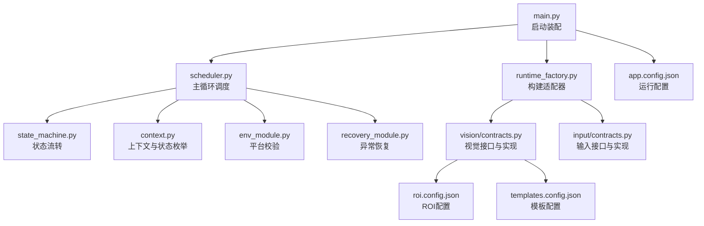
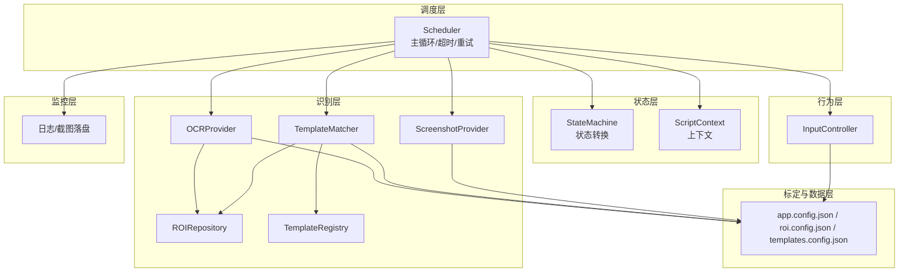
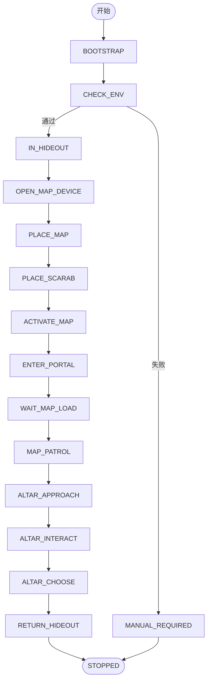
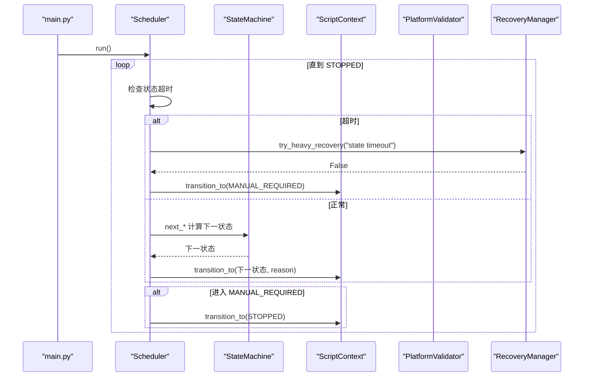
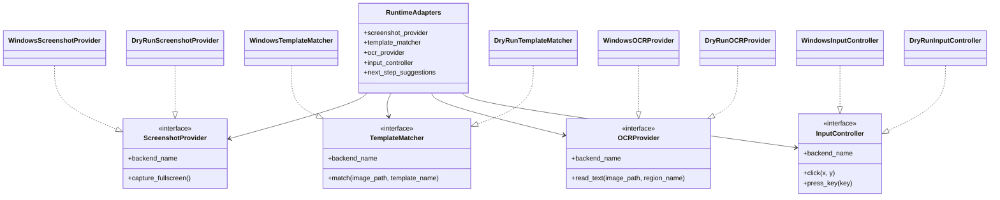
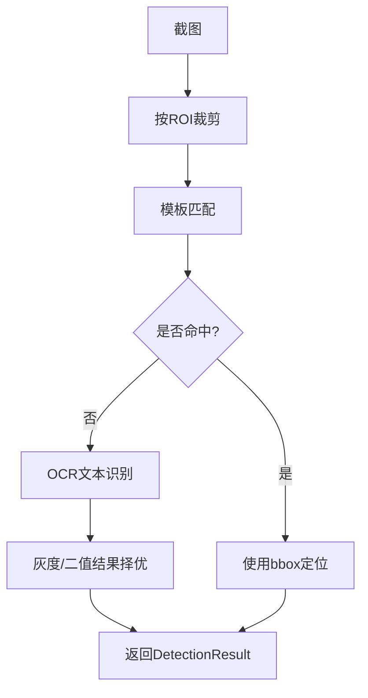
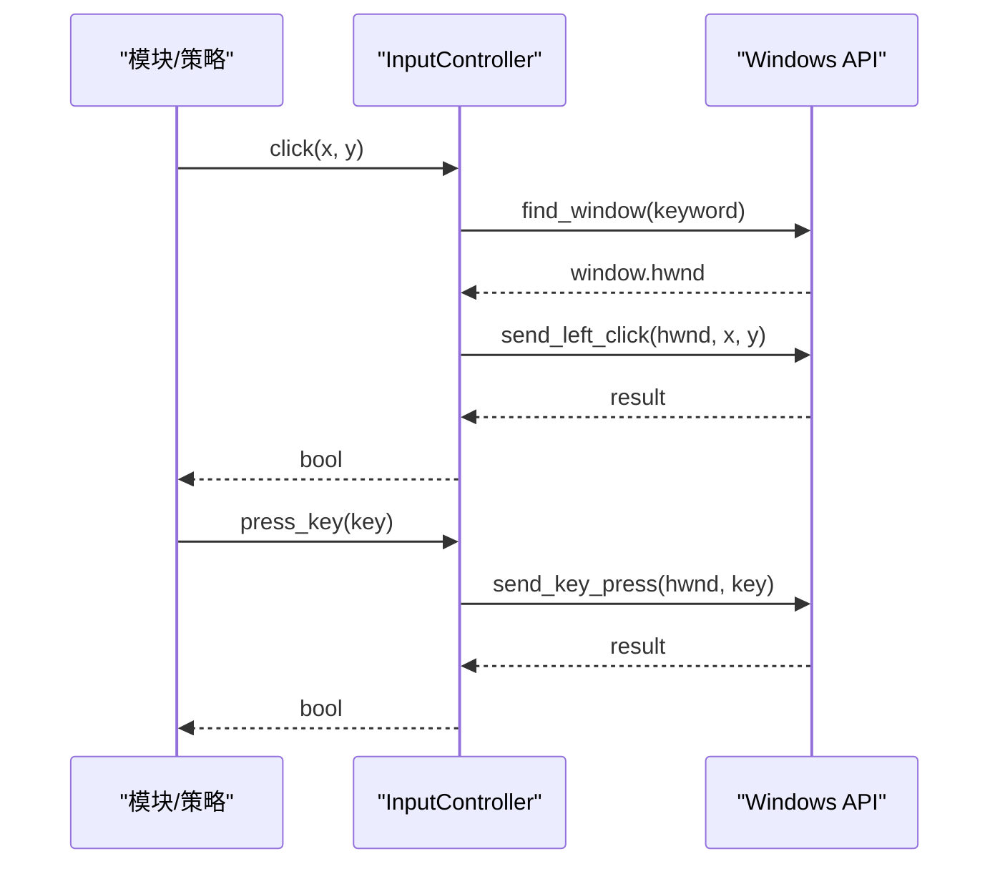
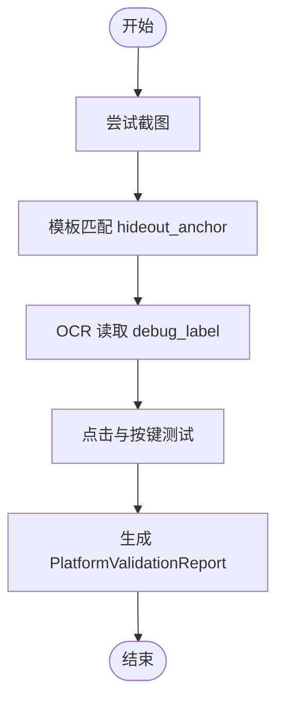
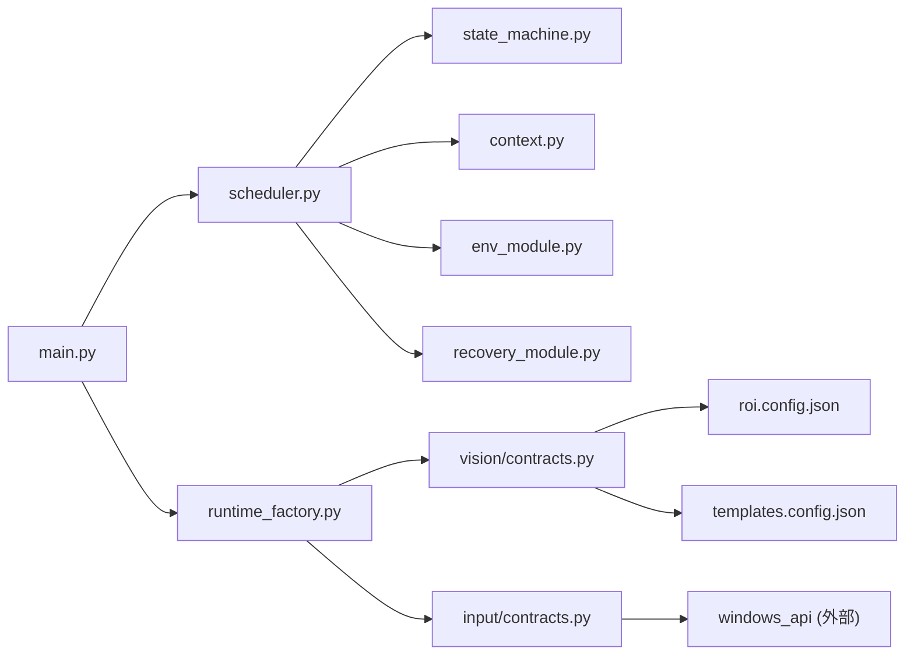

# 技术架构概览

<cite>
**本文引用的文件**
- [src/main.py](file://src/main.py)
- [src/core/scheduler.py](file://src/core/scheduler.py)
- [src/core/state_machine.py](file://src/core/state_machine.py)
- [src/core/context.py](file://src/core/context.py)
- [src/core/runtime_factory.py](file://src/core/runtime_factory.py)
- [src/input/contracts.py](file://src/input/contracts.py)
- [src/vision/contracts.py](file://src/vision/contracts.py)
- [src/modules/env_module.py](file://src/modules/env_module.py)
- [src/modules/recovery_module.py](file://src/modules/recovery_module.py)
- [config/app.config.json](file://config/app.config.json)
- [config/templates.config.json](file://config/templates.config.json)
- [config/roi.config.json](file://config/roi.config.json)
- [tools/test_ocr.py](file://tools/test_ocr.py)
</cite>

## 目录
1. [引言](#引言)
2. [项目结构](#项目结构)
3. [核心组件](#核心组件)
4. [架构总览](#架构总览)
5. [详细组件分析](#详细组件分析)
6. [依赖关系分析](#依赖关系分析)
7. [性能与稳定性考虑](#性能与稳定性考虑)
8. [故障排查指南](#故障排查指南)
9. [结论](#结论)
10. [附录](#附录)

## 引言
本技术架构概览面向“流放之路自动挂贪婪脚本”项目，聚焦分层架构设计、状态机驱动的核心流程、适配器模式带来的平台无关性与可扩展性、视觉识别系统（模板匹配、OCR、ROI）以及输入控制抽象层。文档通过架构图与流程图直观展示各层职责、关键组件交互和数据流向，帮助开发者快速理解整体设计并指导后续扩展与维护。

## 项目结构
项目采用清晰的分层组织：
- 配置层：应用运行参数、分辨率、ROI、模板定义等集中管理
- 核心框架层：调度器、状态机、上下文、运行时工厂、守卫与路径工具
- 平台适配层：截图、模板匹配、OCR、输入控制的接口与Windows/DryRun实现
- 视觉处理层：位图操作、ROI仓库、模板注册表、OCR预处理与后端
- 业务逻辑层：环境校验模块、恢复管理器、未来扩展的地图/祭坛/回城等模块
- 工具层：标定、采集、测试等辅助脚本

图表来源
- [src/main.py:22-50](file://src/main.py#L22-L50)
- [src/core/runtime_factory.py:30-77](file://src/core/runtime_factory.py#L30-L77)
- [src/core/scheduler.py:13-83](file://src/core/scheduler.py#L13-L83)
- [src/core/state_machine.py:6-42](file://src/core/state_machine.py#L6-L42)
- [src/core/context.py:10-62](file://src/core/context.py#L10-L62)
- [src/modules/env_module.py:23-88](file://src/modules/env_module.py#L23-L88)
- [src/modules/recovery_module.py:6-20](file://src/modules/recovery_module.py#L6-L20)
- [src/vision/contracts.py:16-251](file://src/vision/contracts.py#L16-L251)
- [src/input/contracts.py:10-65](file://src/input/contracts.py#L10-L65)
- [config/app.config.json:1-23](file://config/app.config.json#L1-L23)
- [config/templates.config.json:1-9](file://config/templates.config.json#L1-L9)
- [config/roi.config.json:1-31](file://config/roi.config.json#L1-L31)

章节来源
- [src/main.py:22-50](file://src/main.py#L22-L50)
- [config/app.config.json:1-23](file://config/app.config.json#L1-L23)

## 核心组件
- 调度器（Scheduler）：维护主循环、超时与重试、调用状态机、协调恢复策略与环境校验
- 状态机（StateMachine）：定义状态转换规则，支持占位状态顺序执行与人工接管退出
- 上下文（ScriptContext）：统一保存当前/上一状态、轮次、置信度、截图路径、重试计数等
- 运行时工厂（RuntimeAdapters）：根据运行模式装配截图、模板匹配、OCR、输入控制器及下一步建议
- 平台校验（PlatformValidator）：串联截图、模板匹配、OCR、输入链路验证，输出报告与建议
- 恢复管理器（RecoveryManager）：提供轻/中/重三级恢复，失败时进入人工接管
- 视觉接口与实现：ScreenshotProvider、TemplateMatcher、OCRProvider 及其 Windows/DryRun 实现
- 输入接口与实现：InputController 及其 Windows/DryRun 实现

章节来源
- [src/core/scheduler.py:13-83](file://src/core/scheduler.py#L13-L83)
- [src/core/state_machine.py:6-42](file://src/core/state_machine.py#L6-L42)
- [src/core/context.py:10-62](file://src/core/context.py#L10-L62)
- [src/core/runtime_factory.py:21-77](file://src/core/runtime_factory.py#L21-L77)
- [src/modules/env_module.py:11-88](file://src/modules/env_module.py#L11-L88)
- [src/modules/recovery_module.py:6-20](file://src/modules/recovery_module.py#L6-L20)
- [src/vision/contracts.py:16-251](file://src/vision/contracts.py#L16-L251)
- [src/input/contracts.py:10-65](file://src/input/contracts.py#L10-L65)

## 架构总览
本项目采用七层分层架构：调度层、状态层、识别层、行为层、策略层、监控层、标定与数据层。当前代码已落地调度层、状态层、识别层（视觉）、行为层（输入）、部分监控与标定能力，并通过适配器模式屏蔽平台差异。

图表来源
- [src/core/scheduler.py:13-83](file://src/core/scheduler.py#L13-L83)
- [src/core/state_machine.py:6-42](file://src/core/state_machine.py#L6-L42)
- [src/core/context.py:10-62](file://src/core/context.py#L10-L62)
- [src/vision/contracts.py:16-251](file://src/vision/contracts.py#L16-L251)
- [src/input/contracts.py:10-65](file://src/input/contracts.py#L10-L65)
- [config/app.config.json:1-23](file://config/app.config.json#L1-L23)
- [config/roi.config.json:1-31](file://config/roi.config.json#L1-L31)
- [config/templates.config.json:1-9](file://config/templates.config.json#L1-L9)

## 详细组件分析

### 状态机驱动的核心流程
状态机定义了从启动到停止的完整生命周期，包含未知状态与人工接管状态，确保低置信度或异常时优先停机。

图表来源
- [src/core/state_machine.py:6-42](file://src/core/state_machine.py#L6-L42)
- [src/core/context.py:10-28](file://src/core/context.py#L10-L28)

章节来源
- [src/core/state_machine.py:6-42](file://src/core/state_machine.py#L6-L42)
- [src/core/context.py:10-62](file://src/core/context.py#L10-L62)

### 调度器主循环与超时保护
调度器负责驱动状态机、记录日志、处理超时与恢复，并在进入人工接管后安全停止。

图表来源
- [src/core/scheduler.py:32-83](file://src/core/scheduler.py#L32-L83)
- [src/core/state_machine.py:6-42](file://src/core/state_machine.py#L6-L42)
- [src/core/context.py:47-62](file://src/core/context.py#L47-L62)
- [src/modules/recovery_module.py:6-20](file://src/modules/recovery_module.py#L6-L20)

章节来源
- [src/core/scheduler.py:13-83](file://src/core/scheduler.py#L13-L83)
- [src/modules/recovery_module.py:6-20](file://src/modules/recovery_module.py#L6-L20)

### 适配器模式与平台无关性
运行时工厂根据配置选择 Windows 真实实现或 DryRun 模拟实现，统一对外暴露截图、模板匹配、OCR、输入控制器接口，保证上层不感知平台细节。

图表来源
- [src/core/runtime_factory.py:21-77](file://src/core/runtime_factory.py#L21-L77)
- [src/vision/contracts.py:25-251](file://src/vision/contracts.py#L25-L251)
- [src/input/contracts.py:10-65](file://src/input/contracts.py#L10-L65)

章节来源
- [src/core/runtime_factory.py:30-77](file://src/core/runtime_factory.py#L30-L77)
- [src/vision/contracts.py:25-251](file://src/vision/contracts.py#L25-L251)
- [src/input/contracts.py:10-65](file://src/input/contracts.py#L10-L65)

### 视觉识别系统工作原理
视觉层以接口抽象截图、模板匹配、OCR，结合ROI与模板注册表，完成稳定识别。

图表来源
- [src/vision/contracts.py:119-185](file://src/vision/contracts.py#L119-L185)
- [src/vision/contracts.py:188-251](file://src/vision/contracts.py#L188-L251)
- [config/roi.config.json:1-31](file://config/roi.config.json#L1-L31)
- [config/templates.config.json:1-9](file://config/templates.config.json#L1-L9)

章节来源
- [src/vision/contracts.py:119-185](file://src/vision/contracts.py#L119-L185)
- [src/vision/contracts.py:188-251](file://src/vision/contracts.py#L188-L251)
- [config/roi.config.json:1-31](file://config/roi.config.json#L1-L31)
- [config/templates.config.json:1-9](file://config/templates.config.json#L1-L9)

### 输入控制抽象层设计
输入控制通过统一接口屏蔽平台差异，Windows 实现基于窗口句柄发送点击与按键，DryRun 实现用于无头验证。

图表来源
- [src/input/contracts.py:37-65](file://src/input/contracts.py#L37-L65)

章节来源
- [src/input/contracts.py:10-65](file://src/input/contracts.py#L10-L65)

### 平台校验与环境准备
平台校验串联截图、模板匹配、OCR、输入链路，输出通过与否、错误列表与下一步建议，保障后续开发在稳定基础上推进。

图表来源
- [src/modules/env_module.py:38-88](file://src/modules/env_module.py#L38-L88)

章节来源
- [src/modules/env_module.py:23-88](file://src/modules/env_module.py#L23-L88)

## 依赖关系分析
- main.py 作为入口，加载配置并装配运行时适配器，创建校验器、调度器与恢复管理器
- Scheduler 依赖 StateMachine、GuardManager、PlatformValidator、RecoveryManager 与 ScriptContext
- RuntimeAdapters 将视觉与输入的具体实现注入上层，屏蔽平台差异
- 视觉层依赖 ROI 与模板配置，OCR 依赖预处理与 Tesseract 后端
- 输入层依赖 Windows API 进行窗口查找与事件发送

图表来源
- [src/main.py:22-50](file://src/main.py#L22-L50)
- [src/core/runtime_factory.py:30-77](file://src/core/runtime_factory.py#L30-L77)
- [src/core/scheduler.py:13-83](file://src/core/scheduler.py#L13-L83)
- [src/vision/contracts.py:16-251](file://src/vision/contracts.py#L16-L251)
- [src/input/contracts.py:10-65](file://src/input/contracts.py#L10-L65)
- [config/roi.config.json:1-31](file://config/roi.config.json#L1-L31)
- [config/templates.config.json:1-9](file://config/templates.config.json#L1-L9)

章节来源
- [src/main.py:22-50](file://src/main.py#L22-L50)
- [src/core/runtime_factory.py:30-77](file://src/core/runtime_factory.py#L30-L77)
- [src/core/scheduler.py:13-83](file://src/core/scheduler.py#L13-L83)

## 性能与稳定性考虑
- 模板匹配仅在绑定ROI区域内执行，避免大图全图匹配的性能问题
- OCR 同时处理灰度与二值图像，择优返回更稳定的识别结果
- 调度器内置状态超时与重试上限，防止无限循环与误操作
- 低置信度识别不直接触发危险动作，必要时进入人工接管
- 所有高风险动作需具备超时、重试与结果校验机制

[本节为通用指导，不直接分析具体文件]

## 故障排查指南
- 截图链路失败：检查窗口标题关键词、截图目录权限与目标窗口是否存在
- 模板匹配失败：核对模板路径、阈值与ROI标定是否与当前分辨率一致
- OCR失败：确认Tesseract命令、语言与PSM设置，查看调试图与原始图
- 输入链路失败：检查窗口焦点、坐标坐标系（客户区相对坐标）与API返回值
- 状态超时：查看日志中的状态切换原因与重试次数，必要时进入人工接管

章节来源
- [src/modules/env_module.py:38-88](file://src/modules/env_module.py#L38-L88)
- [src/core/scheduler.py:32-83](file://src/core/scheduler.py#L32-L83)
- [src/vision/contracts.py:119-185](file://src/vision/contracts.py#L119-L185)
- [src/vision/contracts.py:188-251](file://src/vision/contracts.py#L188-L251)
- [src/input/contracts.py:37-65](file://src/input/contracts.py#L37-L65)

## 结论
本项目通过分层架构与适配器模式实现了平台无关的自动化脚本基础，状态机驱动确保了复杂流程的可控性与可恢复性。视觉识别系统结合ROI与模板配置，提供了稳定可靠的UI与文本识别能力；输入控制抽象层统一了不同平台的交互方式。建议在后续迭代中逐步完善地图装置、巡逻、祭坛交互与回城闭环，持续积累模板与标定数据，提升成功率与鲁棒性。

[本节为总结，不直接分析具体文件]

## 附录
- 独立OCR测试工具：支持从已有图像或实时窗口截图，按ROI裁切、预处理并调用Tesseract，输出文本、置信度与调试图路径，便于调优OCR参数与区域
- 配置项说明：运行模式、超时与重试、日志与截图目录、窗口标题关键词、OCR语言与PSM、模板与ROI路径、平台校验阈值等

章节来源
- [tools/test_ocr.py:26-181](file://tools/test_ocr.py#L26-L181)
- [config/app.config.json:1-23](file://config/app.config.json#L1-L23)