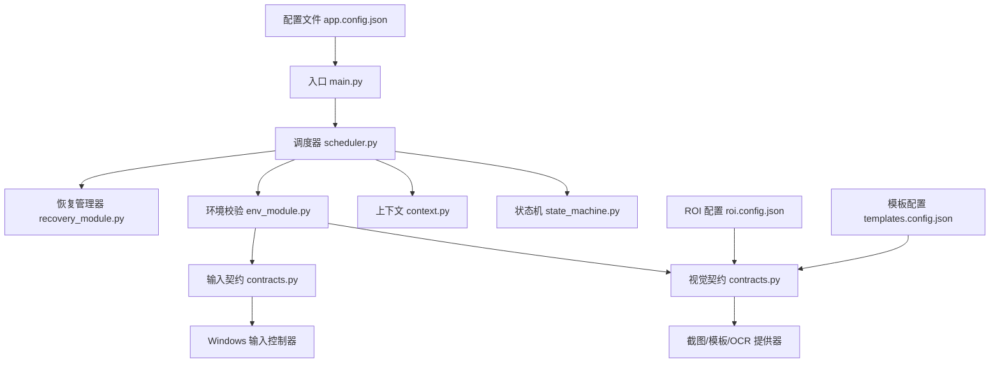
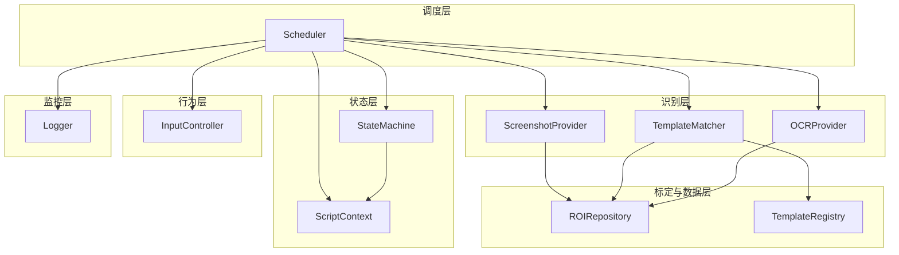
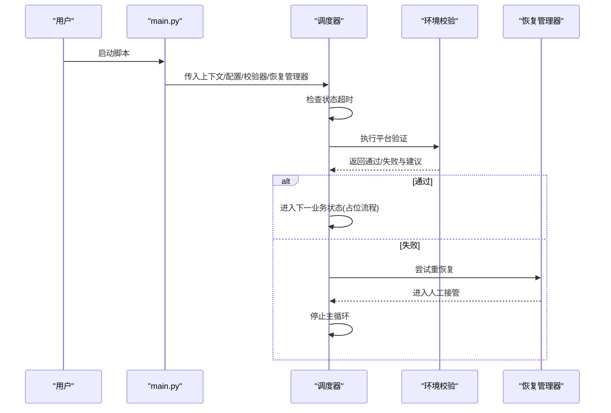
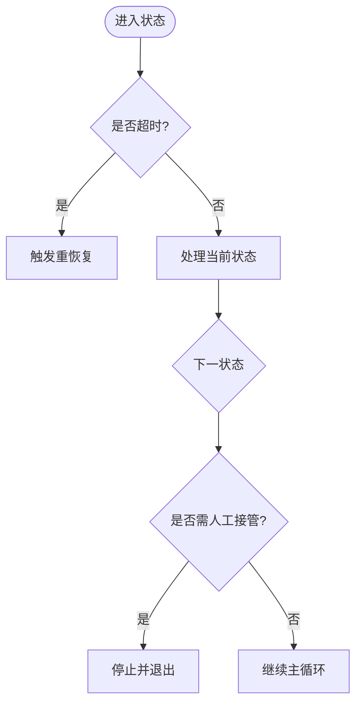
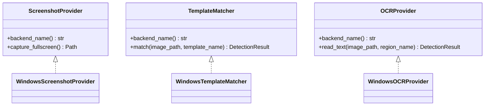
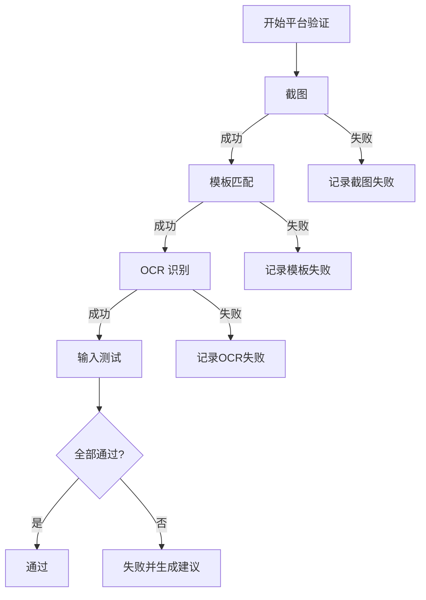
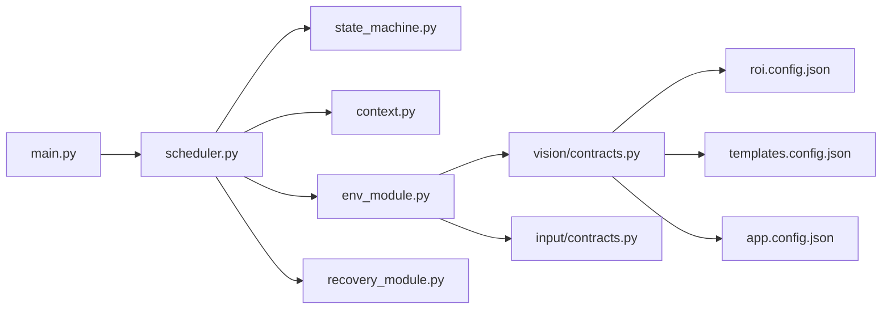

# 项目概述

<cite>
**本文引用的文件**
- [README.md](file://README.md)
- [technical.plan.md](file://technical.plan.md)
- [development.status.md](file://development.status.md)
- [src/main.py](file://src/main.py)
- [src/core/scheduler.py](file://src/core/scheduler.py)
- [src/core/state_machine.py](file://src/core/state_machine.py)
- [src/core/context.py](file://src/core/context.py)
- [src/modules/env_module.py](file://src/modules/env_module.py)
- [src/modules/recovery_module.py](file://src/modules/recovery_module.py)
- [src/vision/contracts.py](file://src/vision/contracts.py)
- [config/app.config.json](file://config/app.config.json)
- [config/roi.config.json](file://config/roi.config.json)
- [config/templates.config.json](file://config/templates.config.json)
- [tools/test_ocr.py](file://tools/test_ocr.py)
</cite>

## 目录
1. [简介](#简介)
2. [项目结构](#项目结构)
3. [核心组件](#核心组件)
4. [架构总览](#架构总览)
5. [详细组件分析](#详细组件分析)
6. [依赖关系分析](#依赖关系分析)
7. [性能与稳定性考量](#性能与稳定性考量)
8. [故障排查指南](#故障排查指南)
9. [结论](#结论)
10. [附录：快速开始](#附录快速开始)

## 简介
本项目面向《流放之路》的“自动挂贪婪”场景，目标是构建一个稳定、可校验、可回退的自动化脚本。第一版不追求全自动无人值守，而是优先验证平台能力（截图、识别、输入），再逐步实现“稳定进图 + 稳定交互一次祭坛”，最后才扩展为完整刷图闭环。设计原则强调：状态机驱动、每一步可校验、失败即止损、人工接管兜底。

- 目标定位：先证明“稳定进图 + 稳定交互一次祭坛”能成立，再扩成完整刷图闭环。
- 核心价值：可复现、可校验、可回放、可止损；以稳定性优先于自动化程度。
- 适用场景：固定分辨率、固定窗口模式、固定 UI 缩放、固定语言与地图类型等严格环境下的单轮或有限轮次自动化。

**章节来源**
- [README.md:14-43](file://README.md#L14-L43)
- [technical.plan.md:13-42](file://technical.plan.md#L13-L42)

## 项目结构
仓库采用分层与职责分离的组织方式：
- 配置层：应用、分辨率、ROI、模板等 JSON 配置集中管理。
- 核心层：调度器、状态机、上下文、守卫、运行时装配。
- 视觉层：截图、ROI 裁切、模板匹配、OCR、模板注册表。
- 输入层：鼠标键盘控制接口（契约）。
- 模块层：环境校验、恢复管理等业务模块骨架。
- 工具层：ROI 标定、模板采集、OCR 测试等辅助脚本。

**图表来源**
- [src/main.py:22-50](file://src/main.py#L22-L50)
- [src/core/scheduler.py:13-47](file://src/core/scheduler.py#L13-L47)
- [src/core/state_machine.py:6-41](file://src/core/state_machine.py#L6-L41)
- [src/core/context.py:10-45](file://src/core/context.py#L10-L45)
- [src/modules/env_module.py:23-87](file://src/modules/env_module.py#L23-L87)
- [src/vision/contracts.py:25-55](file://src/vision/contracts.py#L25-L55)
- [config/app.config.json:1-22](file://config/app.config.json#L1-L22)
- [config/roi.config.json:1-31](file://config/roi.config.json#L1-L31)
- [config/templates.config.json:1-9](file://config/templates.config.json#L1-L9)

**章节来源**
- [technical.plan.md:132-217](file://technical.plan.md#L132-L217)
- [development.status.md:72-210](file://development.status.md#L72-L210)

## 核心组件
- 调度器：主循环编排，负责超时检测、状态流转、错误恢复触发。
- 状态机：定义状态及切换逻辑，支持占位流程与 dry_run 模式。
- 上下文：统一维护当前状态、重试计数、置信度、截图路径等运行期数据。
- 环境校验：串联截图、模板匹配、OCR、输入链路，输出通过/失败与建议。
- 恢复管理器：轻/中/重恢复策略骨架，重恢复进入人工接管。
- 视觉契约：截图、模板匹配、OCR 的统一接口与 Windows 真实实现。
- 配置：应用、ROI、模板等参数化配置，支撑可复现实验与回归对比。

**章节来源**
- [src/core/scheduler.py:13-83](file://src/core/scheduler.py#L13-L83)
- [src/core/state_machine.py:6-41](file://src/core/state_machine.py#L6-L41)
- [src/core/context.py:10-62](file://src/core/context.py#L10-L62)
- [src/modules/env_module.py:11-87](file://src/modules/env_module.py#L11-L87)
- [src/modules/recovery_module.py:6-19](file://src/modules/recovery_module.py#L6-L19)
- [src/vision/contracts.py:16-55](file://src/vision/contracts.py#L16-L55)

## 架构总览
系统采用七层分层架构：调度层、状态层、识别层、行为层、策略层、监控层、标定与数据层。当前代码已落地调度层、状态层、识别层的部分契约与 Windows 实现、以及环境与恢复模块骨架。

**图表来源**
- [src/core/scheduler.py:13-47](file://src/core/scheduler.py#L13-L47)
- [src/core/state_machine.py:6-41](file://src/core/state_machine.py#L6-L41)
- [src/core/context.py:10-62](file://src/core/context.py#L10-L62)
- [src/vision/contracts.py:25-55](file://src/vision/contracts.py#L25-L55)
- [src/vision/contracts.py:119-185](file://src/vision/contracts.py#L119-L185)
- [src/vision/contracts.py:188-250](file://src/vision/contracts.py#L188-L250)

## 详细组件分析

### 启动与调度流程
- 入口加载配置并初始化日志。
- 通过运行时工厂装配截图、模板匹配、OCR、输入等适配器。
- 创建环境校验器与恢复管理器，注入调度器。
- 调度器主循环：检查超时 -> 处理当前状态 -> 必要时进入人工接管并停止。

**图表来源**
- [src/main.py:22-50](file://src/main.py#L22-L50)
- [src/core/scheduler.py:32-47](file://src/core/scheduler.py#L32-L47)
- [src/modules/env_module.py:38-87](file://src/modules/env_module.py#L38-L87)
- [src/modules/recovery_module.py:15-19](file://src/modules/recovery_module.py#L15-L19)

**章节来源**
- [src/main.py:22-50](file://src/main.py#L22-L50)
- [src/core/scheduler.py:32-83](file://src/core/scheduler.py#L32-L83)

### 状态机与上下文
- 状态枚举覆盖从启动到回城的完整阶段，包含异常与人工接管态。
- 上下文记录状态切换原因、重试次数、置信度、截图路径等，便于回放与诊断。
- 状态机在 dry_run 模式下按顺序推进占位状态，便于联调。

**图表来源**
- [src/core/state_machine.py:6-41](file://src/core/state_machine.py#L6-L41)
- [src/core/context.py:10-62](file://src/core/context.py#L10-L62)
- [src/core/scheduler.py:32-83](file://src/core/scheduler.py#L32-L83)

**章节来源**
- [src/core/state_machine.py:6-41](file://src/core/state_machine.py#L6-L41)
- [src/core/context.py:10-62](file://src/core/context.py#L10-L62)

### 视觉识别与输入契约
- 截图提供器：Windows 真实窗口客户区截图，避免边框干扰后续 ROI。
- 模板匹配：基于配置的模板与 ROI 进行匹配，越界时安全失败。
- OCR：Tesseract 后端，灰度/二值双路预处理，TSV 解析与置信度合并。
- 输入控制器：点击与按键发送，保留调试日志。

**图表来源**
- [src/vision/contracts.py:25-55](file://src/vision/contracts.py#L25-L55)
- [src/vision/contracts.py:101-185](file://src/vision/contracts.py#L101-L185)
- [src/vision/contracts.py:188-250](file://src/vision/contracts.py#L188-L250)

**章节来源**
- [src/vision/contracts.py:101-250](file://src/vision/contracts.py#L101-L250)

### 环境校验与恢复
- 环境校验串联截图、模板匹配、OCR、输入四项能力，逐项捕获异常并生成建议。
- 恢复管理器提供轻/中/重恢复接口，重恢复将进入人工接管并停止自动流程。

**图表来源**
- [src/modules/env_module.py:38-87](file://src/modules/env_module.py#L38-L87)
- [src/modules/recovery_module.py:6-19](file://src/modules/recovery_module.py#L6-L19)

**章节来源**
- [src/modules/env_module.py:38-87](file://src/modules/env_module.py#L38-L87)
- [src/modules/recovery_module.py:6-19](file://src/modules/recovery_module.py#L6-L19)

### 分阶段发展与 MVP
- 阶段规划：M0 平台验证 → M1 稳定进图 → M2 祭坛交互 → M3 安全收尾 → M4 完整闭环。
- MVP 范围：人工准备地图与圣甲虫，脚本自动进图、巡逻、识别并交互一次祭坛，成功后回城或安全停机。
- 验收标准：连续成功进图、多数轮次完成祭坛交互、每步有超时与结果校验、失败有限重试与安全停机。

**章节来源**
- [README.md:126-189](file://README.md#L126-L189)
- [technical.plan.md:220-282](file://technical.plan.md#L220-L282)

## 依赖关系分析
- 入口依赖调度器与环境校验器，调度器依赖状态机、上下文、守卫与恢复管理器。
- 环境校验依赖视觉契约（截图、模板、OCR）与输入契约。
- 视觉契约依赖 ROI 与模板注册表，模板匹配受 ROI 越界保护。
- OCR 依赖 Tesseract 命令行与预处理管线，调试图落盘便于问题定位。

**图表来源**
- [src/main.py:22-50](file://src/main.py#L22-L50)
- [src/core/scheduler.py:13-47](file://src/core/scheduler.py#L13-L47)
- [src/modules/env_module.py:23-87](file://src/modules/env_module.py#L23-L87)
- [src/vision/contracts.py:119-185](file://src/vision/contracts.py#L119-L185)
- [config/app.config.json:1-22](file://config/app.config.json#L1-L22)
- [config/roi.config.json:1-31](file://config/roi.config.json#L1-L31)
- [config/templates.config.json:1-9](file://config/templates.config.json#L1-L9)

**章节来源**
- [src/main.py:22-50](file://src/main.py#L22-L50)
- [src/core/scheduler.py:13-83](file://src/core/scheduler.py#L13-L83)
- [src/modules/env_module.py:23-87](file://src/modules/env_module.py#L23-L87)
- [src/vision/contracts.py:119-250](file://src/vision/contracts.py#L119-L250)

## 性能与稳定性考量
- 模板匹配当前为纯 Python 暴力实现，适合小 ROI、小模板验证；后续可引入更高效算法以提升性能。
- 所有动作支持超时与重试上限，关键识别带置信度，低置信度不驱动危险动作。
- ROI 越界返回安全失败，避免误判与崩溃。
- 日志与调试截图贯穿全流程，便于问题回溯与回归对比。

[本节为通用指导，不直接分析具体文件]

## 故障排查指南
- 若环境校验失败，优先修复截图链路、输入链路、ROI 标定与模板质量、OCR 区域与预处理。
- 使用独立 OCR 测试脚本验证 Tesseract 安装与识别效果，查看调试图与原图、灰度图、二值图。
- 关注调度器的超时与恢复日志，确认是否进入人工接管状态。
- 检查配置项：窗口标题关键词、OCR 语言/PSM/Tesseract 命令、模板阈值与 ROI 坐标。

**章节来源**
- [README.md:92-123](file://README.md#L92-L123)
- [development.status.md:213-239](file://development.status.md#L213-L239)
- [tools/test_ocr.py:26-181](file://tools/test_ocr.py#L26-L181)

## 结论
本项目以“稳定优先”为核心设计理念，通过状态机驱动、视觉识别与输入控制的解耦架构，确保每一步可校验、失败可止损。当前处于 M0 平台可行性阶段，基础设施基本就绪，待 Tesseract 安装后进行首次真实验证。下一步聚焦“稳定进图 + 稳定交互一次祭坛”，逐步扩展至完整闭环。

[本节为总结性内容，不直接分析具体文件]

## 附录：快速开始
- 环境准备
  - 固定分辨率、窗口模式、UI 缩放、语言、地图类型等严格环境。
  - 安装 Tesseract OCR 并配置命令行路径（可通过配置项指定）。
- 运行入口
  - 运行入口脚本，加载应用与分辨率配置，初始化日志与运行时适配器。
- 平台验证
  - 执行环境校验，检查截图、模板匹配、OCR、输入四项能力。
  - 如失败，根据建议修复对应链路后再继续。
- 基础功能
  - 在 dry_run 模式下可跑通占位状态流转，验证调度与状态机骨架。
  - 使用 ROI 标定与模板采集工具准备真实模板与 ROI。
  - 使用 OCR 测试脚本验证识别效果与调试图输出。
- 预期效果
  - 通过平台验证后，具备稳定截图、识别与输入能力。
  - 随后实现“稳定进图 + 稳定交互一次祭坛”，最终扩展为多轮闭环。

**章节来源**
- [README.md:63-112](file://README.md#L63-L112)
- [development.status.md:39-68](file://development.status.md#L39-L68)
- [tools/test_ocr.py:26-181](file://tools/test_ocr.py#L26-L181)
- [config/app.config.json:1-22](file://config/app.config.json#L1-L22)