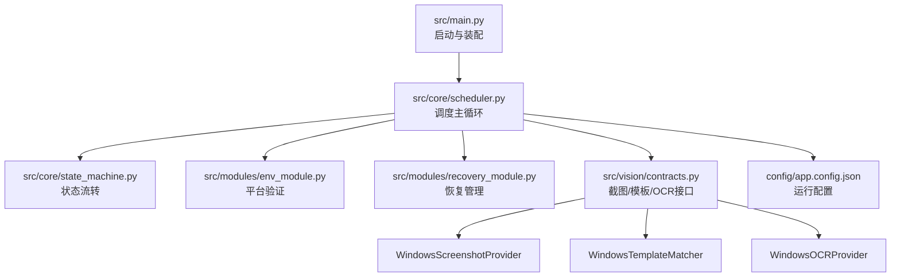
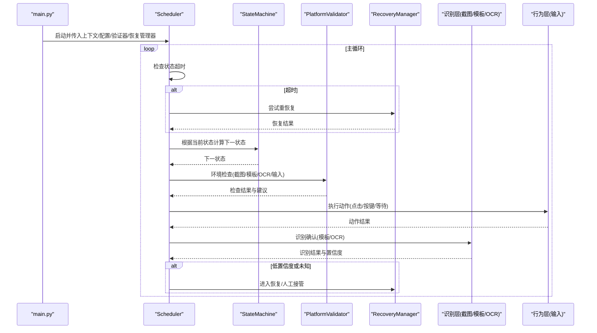
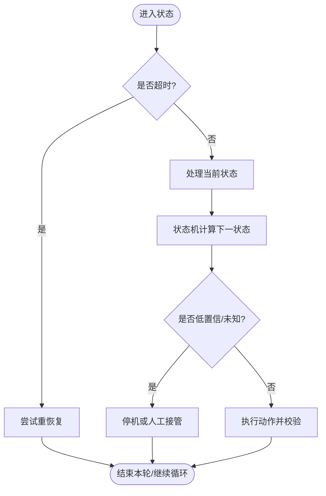
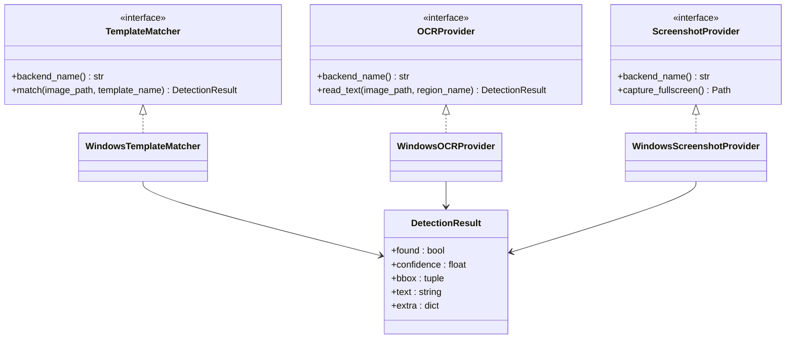
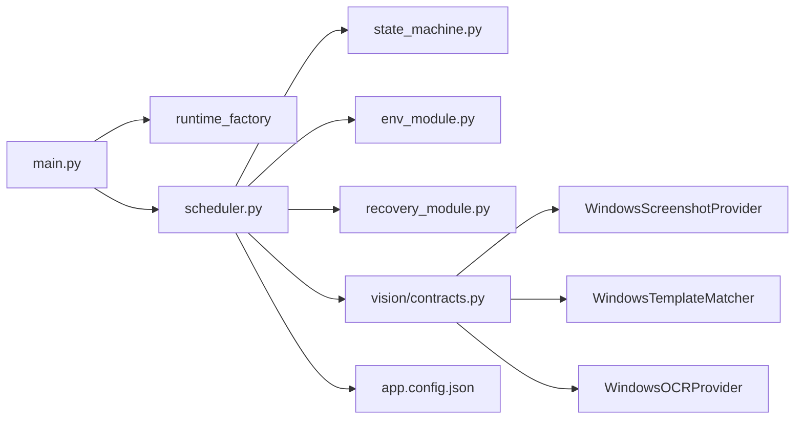

# 项目背景与目标

<cite>
**本文引用的文件**
- [README.md](file://README.md)
- [technical.plan.md](file://technical.plan.md)
- [development.status.md](file://development.status.md)
- [src/main.py](file://src/main.py)
- [src/core/scheduler.py](file://src/core/scheduler.py)
- [src/core/state_machine.py](file://src/core/state_machine.py)
- [src/vision/contracts.py](file://src/vision/contracts.py)
- [config/app.config.json](file://config/app.config.json)
</cite>

## 目录
1. [引言](#引言)
2. [项目结构](#项目结构)
3. [核心组件](#核心组件)
4. [架构总览](#架构总览)
5. [详细组件分析](#详细组件分析)
6. [依赖关系分析](#依赖关系分析)
7. [性能考量](#性能考量)
8. [故障排查指南](#故障排查指南)
9. [结论](#结论)
10. [附录](#附录)

## 引言
本项目面向《流放之路》中的“贪婪祭坛”刷图场景，目标是实现稳定、可校验、可回滚的自动化：在固定环境下完成“进图—巡逻—发现并交互一次贪婪祭坛—安全收尾”的最小闭环。项目的真实目的不是立刻做到全自动无人值守，而是先验证平台能力（截图、识别、输入）和关键链路稳定性，再逐步扩展为完整多轮闭环。

从需求层面看，项目强调“稳定性优先于功能完整性”，通过状态机驱动、严格超时重试、低置信度不触发危险动作、未知状态优先停机等约束，确保脚本在任何异常下都能安全止损，避免无限误操作。

本章节聚焦项目背景、痛点、MVP定义、与其他方案的区别与优势、边界约束，以及用具体游戏场景说明自动化价值。

**章节来源**
- [README.md:14-44](file://README.md#L14-L44)
- [README.md:47-90](file://README.md#L47-L90)
- [README.md:126-190](file://README.md#L126-L190)
- [README.md:192-227](file://README.md#L192-L227)
- [technical.plan.md:13-43](file://technical.plan.md#L13-L43)

## 项目结构
仓库采用分层设计：调度层、状态层、识别层、行为层、策略层、监控层、标定与数据层。当前代码已实现入口装配、调度主循环、状态机骨架、Windows 截图/模板匹配/OCR 提供器、ROI 与模板配置、日志与调试输出等基础设施。

**图表来源**
- [src/main.py:22-50](file://src/main.py#L22-L50)
- [src/core/scheduler.py:13-47](file://src/core/scheduler.py#L13-L47)
- [src/core/state_machine.py:6-41](file://src/core/state_machine.py#L6-L41)
- [src/vision/contracts.py:101-251](file://src/vision/contracts.py#L101-L251)
- [config/app.config.json:1-22](file://config/app.config.json#L1-L22)

**章节来源**
- [technical.plan.md:45-130](file://technical.plan.md#L45-L130)
- [development.status.md:72-193](file://development.status.md#L72-L193)

## 核心组件
- 调度器：维护主循环、超时与重试、人工接管与停止。
- 状态机：定义状态序列与过渡规则，支持 UNKNOWN 与 MANUAL_REQUIRED 等安全态。
- 识别层：统一截图、ROI 裁切、模板匹配、OCR 双路（灰度/二值）选优。
- 行为层：封装鼠标点击、键盘按键、等待与校验（后续扩展）。
- 监控层：日志、截图落盘、识别结果记录、失败案例归档。
- 标定与数据层：ROI 标定、模板采集、OCR 样本管理、回归对比。

这些组件共同支撑“稳定进图 + 稳定交互一次祭坛”的 MVP 目标，并在异常时快速止损。

**章节来源**
- [src/core/scheduler.py:13-83](file://src/core/scheduler.py#L13-L83)
- [src/core/state_machine.py:6-41](file://src/core/state_machine.py#L6-L41)
- [src/vision/contracts.py:16-251](file://src/vision/contracts.py#L16-L251)
- [development.status.md:72-193](file://development.status.md#L72-L193)

## 架构总览
系统以“调度器驱动状态机”为核心，识别层提供“看到了什么”，行为层负责“做什么”，策略层决定“怎么做”。所有高风险动作必须带超时、重试上限与结果校验；低置信度识别不得直接驱动危险动作；未知状态优先停机。

**图表来源**
- [src/main.py:22-50](file://src/main.py#L22-L50)
- [src/core/scheduler.py:32-83](file://src/core/scheduler.py#L32-L83)
- [src/core/state_machine.py:6-41](file://src/core/state_machine.py#L6-L41)
- [src/vision/contracts.py:101-251](file://src/vision/contracts.py#L101-L251)

## 详细组件分析

### 调度器与状态机
- 调度器负责：
  - 主循环推进、状态超时检测、错误日志与恢复调用。
  - 将平台验证结果写入上下文，驱动状态机切换。
- 状态机负责：
  - 定义 BOOTSTRAP -> CHECK_ENV -> IN_HIDEOUT -> ... -> STOPPED 的流程。
  - 在 dry_run 模式下按顺序推进占位状态，便于联调。
  - 支持 UNKNOWN 与 MANUAL_REQUIRED 安全态，防止误操作。

**图表来源**
- [src/core/scheduler.py:32-83](file://src/core/scheduler.py#L32-L83)
- [src/core/state_machine.py:6-41](file://src/core/state_machine.py#L6-L41)

**章节来源**
- [src/core/scheduler.py:13-83](file://src/core/scheduler.py#L13-L83)
- [src/core/state_machine.py:6-41](file://src/core/state_machine.py#L6-L41)

### 识别层（截图/模板/OCR）
- 截图：Windows 窗口客户区截图，避免边框干扰 ROI。
- 模板匹配：基于 ROI 裁剪后的小范围匹配，降低纯 Python 暴力匹配开销。
- OCR：Tesseract 命令行后端，ROI 裁切 + 灰度归一化 + Otsu 二值化预处理，双路识别自动选优，保存调试图用于回溯。

**图表来源**
- [src/vision/contracts.py:16-251](file://src/vision/contracts.py#L16-L251)

**章节来源**
- [src/vision/contracts.py:101-251](file://src/vision/contracts.py#L101-L251)
- [development.status.md:100-193](file://development.status.md#L100-L193)

### 配置与环境
- 运行模式：windows/dry_run。
- 分辨率与窗口标题关键词：用于定位游戏窗口。
- OCR 语言与 PSM、Tesseract 命令路径：影响文本识别质量。
- 平台验证阈值：截图成功率、模板匹配阈值、OCR 置信度阈值、输入成功率阈值。

**章节来源**
- [config/app.config.json:1-22](file://config/app.config.json#L1-L22)
- [development.status.md:161-193](file://development.status.md#L161-L193)

## 依赖关系分析
- main.py 装配运行时适配器（截图/模板/OCR/输入），注入 Scheduler。
- Scheduler 依赖 StateMachine、GuardManager、PlatformValidator、RecoveryManager。
- 识别层通过 contracts 抽象，便于替换后端（dry_run/windows）。
- 配置集中管理，避免散落在业务逻辑中。

**图表来源**
- [src/main.py:22-50](file://src/main.py#L22-L50)
- [src/core/scheduler.py:13-47](file://src/core/scheduler.py#L13-L47)
- [src/vision/contracts.py:101-251](file://src/vision/contracts.py#L101-L251)
- [config/app.config.json:1-22](file://config/app.config.json#L1-L22)

**章节来源**
- [src/main.py:22-50](file://src/main.py#L22-L50)
- [src/core/scheduler.py:13-47](file://src/core/scheduler.py#L13-L47)
- [src/vision/contracts.py:101-251](file://src/vision/contracts.py#L101-L251)

## 性能考量
- 模板匹配当前为纯 Python 实现，适合小 ROI、小模板验证；后续可引入更高效算法以提升性能。
- OCR 使用 Tesseract 命令行，需安装外部依赖；双路识别（灰度/二值）提升鲁棒性但增加耗时。
- ROI 裁剪减少搜索区域，降低匹配成本。
- 建议：限制单次识别图像尺寸、缓存常用模板、批量处理截图、异步化长耗时任务。

[本节为通用性能讨论，不直接分析具体文件]

## 故障排查指南
- 前置可行性验证未通过时，优先解决截图链路、输入链路、分辨率与 ROI 标定、模板采集质量、OCR 区域与预处理。
- 常见风险：游戏更新导致模板失效、地图环境变化导致识别率下降、OCR 在特效/滤镜下误读、网络波动导致状态判断失真、长时间运行状态漂移、截图/输入链路不稳定。
- 日志与截图：记录每次状态切换、识别结果与置信度、点击/按键、失败原因、恢复动作、每轮耗时与结果；保存状态切换前后截图、识别失败截图、祭坛候选截图、OCR 截图、回城失败截图、未知状态截图。

**章节来源**
- [README.md:92-124](file://README.md#L92-L124)
- [README.md:229-266](file://README.md#L229-L266)
- [technical.plan.md:505-532](file://technical.plan.md#L505-L532)
- [development.status.md:213-239](file://development.status.md#L213-L239)

## 结论
本项目以“稳定进图 + 稳定交互一次祭坛”为 MVP，坚持稳定性优先于功能完整性。通过状态机驱动、严格超时重试、低置信度不触发危险动作、未知状态优先停机等机制，确保脚本在异常情况下能安全止损。第一版聚焦平台可行性验证与基础链路打通，后续再扩展拾取、存仓、下一轮与补货等能力。相比其他方案，本项目强调可复现、可校验、可回放、可止损，并以 ROI 与模板、OCR 双路识别提升鲁棒性，同时保留标定与回放工具链，便于持续迭代与回归测试。

[本节为总结性内容，不直接分析具体文件]

## 附录

### 项目背景与痛点
- 痛点：手动刷贪婪祭坛重复度高、易疲劳；界面元素复杂、识别难度高；长时间运行易出现状态漂移与误操作。
- 需求：在固定环境下实现稳定的截图、识别与输入，保证每一步可校验、失败可止损。
- 价值：提高玩家效率，减少重复劳动；为后续更复杂的自动化（拾取、存仓、多轮）打下坚实基础。

**章节来源**
- [README.md:14-44](file://README.md#L14-L44)
- [README.md:47-90](file://README.md#L47-L90)

### MVP 定义与验收标准
- MVP 范围：人工提前准备地图与圣甲虫，脚本自动进图、巡逻、识别并交互一次贪婪祭坛，成功后自动回城或安全停机。
- 成功标准：连续成功进图 20 次；多数轮次能完成一次祭坛交互；每一步有超时与结果校验；失败最多有限重试；失败后安全停机。
- 结束条件：祭坛已成功交互、地图搜索超时、卡住恢复失败、状态识别连续失败、用户主动停止。

**章节来源**
- [README.md:160-190](file://README.md#L160-L190)

### 与其他解决方案的区别与优势
- 区别：不追求智能全图寻路与复杂战斗策略自适应；不承诺多分辨率/多地图兼容；不实现自动采购与库存管理。
- 优势：强调可复现、可校验、可回放、可止损；通过 ROI 与模板、OCR 双路识别提升鲁棒性；保留标定与回放工具链，便于回归与问题定位。

**章节来源**
- [README.md:78-90](file://README.md#L78-L90)
- [technical.plan.md:13-43](file://technical.plan.md#L13-L43)

### 边界约束与现阶段不实现的功能
- 明确不做：多分辨率兼容、多地图类型兼容、智能全图寻路、自动采购和库存管理、复杂仓库整理、长时间完全无人值守、复杂战斗策略自适应。
- 原因：复杂度对第一版过高，且会分散资源，影响稳定性验证与 MVP 达成。

**章节来源**
- [README.md:78-90](file://README.md#L78-L90)
- [technical.plan.md:370-459](file://technical.plan.md#L370-L459)

### 具体游戏场景说明自动化价值
- 场景：玩家进入地图后，脚本自动巡逻并识别屏幕中心与小地图特征，发现祭坛候选后靠近并交互，选择目标选项（如贪婪、层数、掉落相关），校验界面打开与选择结果，随后回城或安全停机。
- 价值：减少重复操作与误点风险；在固定环境下显著提升单轮效率；为后续多轮闭环奠定基础。

**章节来源**
- [technical.plan.md:408-444](file://technical.plan.md#L408-L444)
- [README.md:126-190](file://README.md#L126-L190)